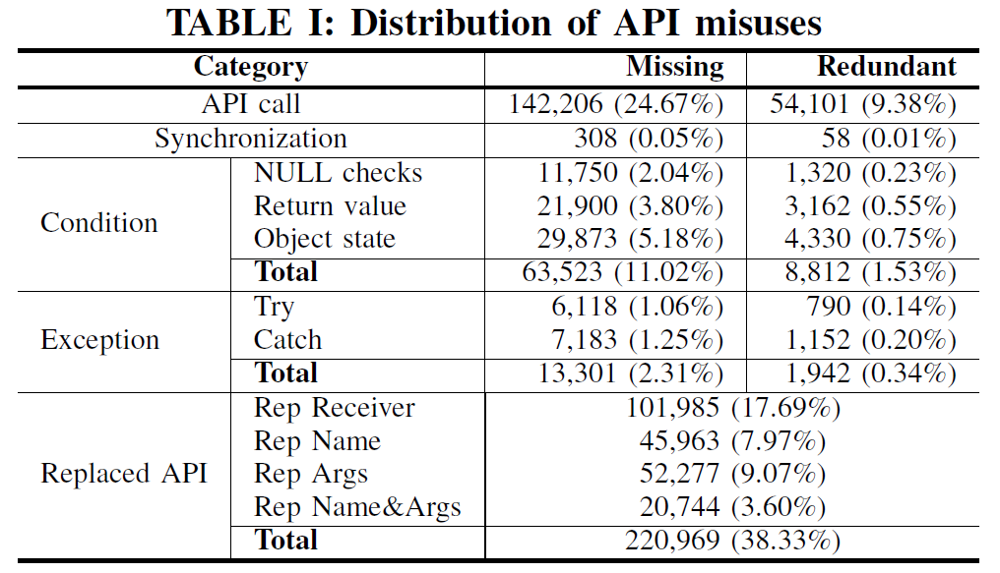

## A Large-scale Study on API Misuses in the Wild

#### 摘要

根据对Github上与bug-fixing相关的commit的分析，针对API Misuse的实证研究。根据API Misuse的错误类型将其划分成了9类，然后分别从中提取出一些常见的pattern，并分析对检测API Misuse的有效性。

#### 概念

API(Application Programming Interfaces): 应用程序接口，是为调用第三方库和框架提供的接口，以避免对相同功能的重复实现。

API Misuse:违反某些从代码中提取的，频繁使用的API pattern；违反了代码中的特定约束

目前的API Misuse检测方法大多只能在某些特定的数据集上比较有效，并且在MUBENCH上误报较高

#### 主要贡献

1. 一个公开的**数据集**，包括528546个Github上关于bug-fixing的commit
2. 一个广泛研究API Misuse，并通过静态分析对其进行分类的**Study**
3. 提供了很多**API Misuse patterns**，可用于补充现有的API Misuse检测工具，也可以检测未知的API Misuse
4. 对不同类别的API Misuse的重要性提供了一些**Guidelines**

#### 背景

现有的针对传统程序中API Misuse的检测方法分类：

* 使用数据挖掘方法的检测工具

    从软件的历史版本、常用的代码组合、程序的trace等中分析提取pattern。主要思想是，一个pattern使用得越频繁，则越有可能是能够检测API Misuse的pattern。

    基于数据挖掘的检测方法也能用来检测特定类型的API Misuse，比如null check、exception-handling、resource-leaking

* 使用程序分析或机器学习方法的检测工具

    基于路径或数据流分析、静态分析与模型检查结合、使用隐马尔科夫模型检查调用序列的异常、使用pattern mutation生成错误pattern、使用NLP分析API文档

#### 实证研究

1. **数据收集**

* 首先收集Github上2011~2018年间的所有代码

* 然后排除非Java代码以及所有的test case，并筛选出包含指定关键词的部分（抽样后发现94%的是真实bug fix）
* 最后根据设置的标准再次删除不符合要求的部分：
    * 变动超过五个文件或六行代码(变动过大)
    * 非Java代码的文件
    * 已经被移除或者新修改代码的文件

2. **API Misuse分类**

* ***Condition***：包括特定API调用的缺失与多余，具体包括

    * **NULL checks**：检查由API返回的变量或者将用作后续调用的变量

        $o.API();\Rightarrow \mathbf{if(o!=null)}\{o.API();\}$

    * **Return value**：检查API的返回值

        $o=API();a=list.get(o);\Rightarrow o=API();\mathbf{if(o<0)\{o=0;\}}a=list.get(o);$

    * **Object state**：检查即将被API调用的变量

        $a=list.get(i);\Rightarrow \mathbf{if(i>0)}\{a=list.get(i)\}$

* ***Exception***：包括缺失或多余的异常处理，即需要进行添加或删除$try$或$catch$

* ***Synchronization***：在多线程环境下缺失或多余的同步操作

* ***API Call***：包括缺失或多余的API调用，具体包括

    * **Missing & Redundant API call**：

        * 缺失的API调用是指API的使用约束要求在特定位置调用某个API，但是实际并没有调用，比如文件操作之后没有调用$File.close()$
        * 多余的API调用是指某个API在一个不该被调用的地方调用了，比如在List迭代结束之后调用$List.remove()$

    * **Replaced Arguments**：

        表示在使用API的时候使用了错误的参数，或者参数传入的顺序错误，比如调用$nextInt()$时使用成了$nextInt(10)$

    * **Replaced Name**：

        表示在使用API的时候使用了相同的参数，但是使用了不同的函数，比如$indexOf$和$lastIndexOf$

    * **Replaced Name and Arguments**：

        表示使用API时参数和函数名都错误，比如在重复建立数据库链接时，使用了$createStatement()$，而正确的用法应该是$prepareStatement(String)$

    * **Replaced Receiver**：

        表示不同Class中的API Misuse，比如在比较字符串时，使用$A.equals(B);$，而正确的用法是$Objects.equals(A,B)$

3. **操作类型分析**

**API Misuse的分布**

1. API Misuse中最普遍的是API call和Replaced API，并且API调用缺失要比多余更常见
2. 最常见的API Misuse是同一个Class中的函数名或参数问题

