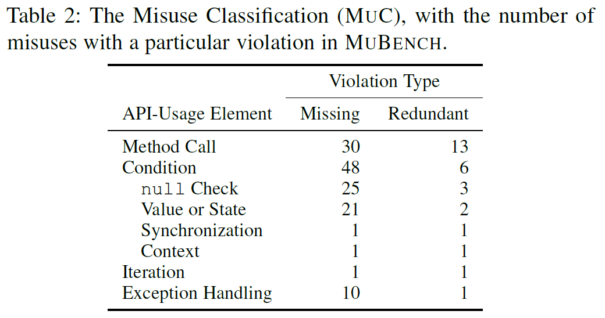
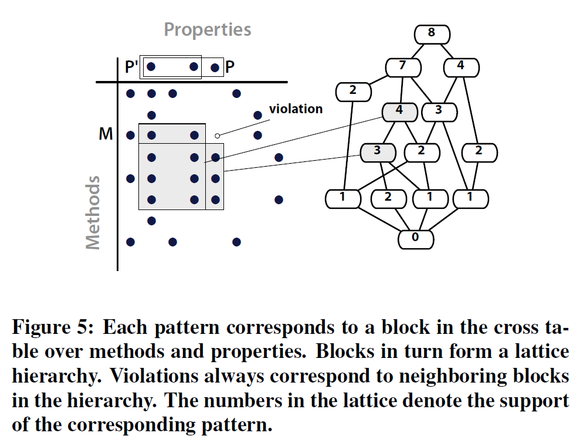
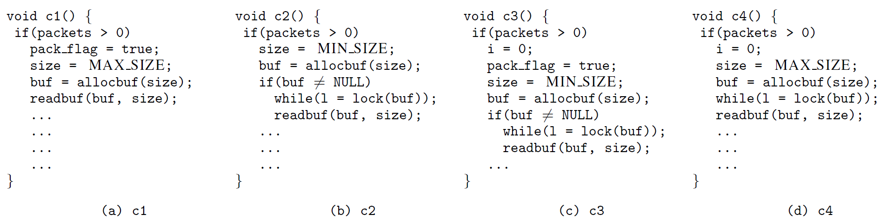
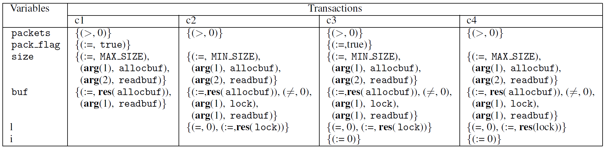
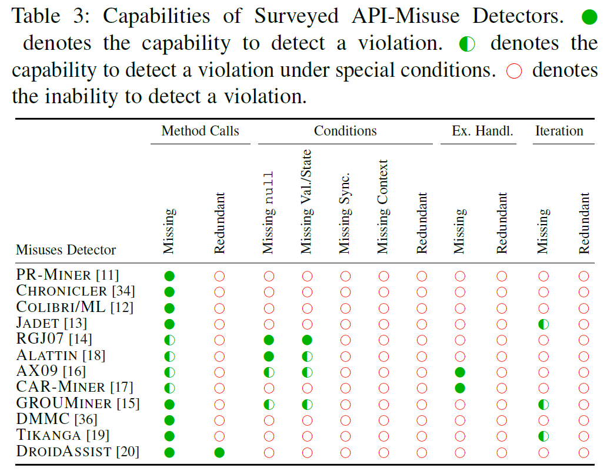
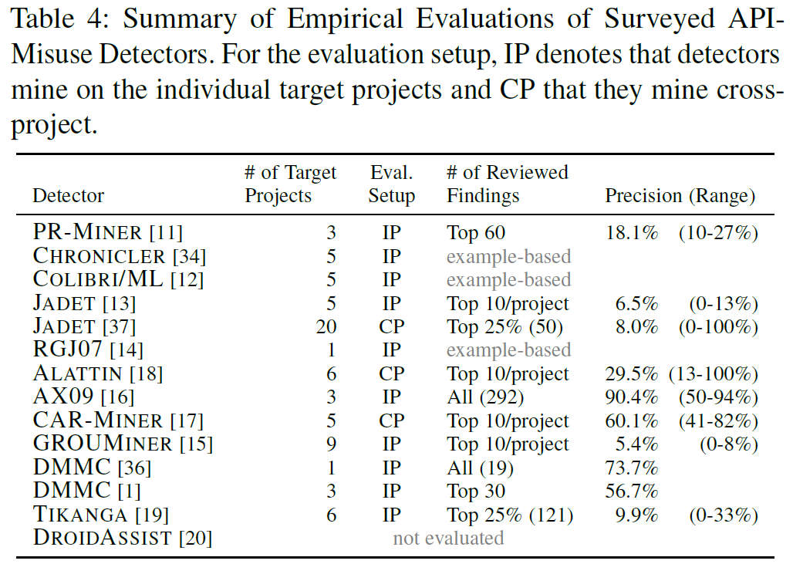

## A Systematic Evaluation of Static API-Misuse Detectors

#### API Misuse Classification

1. Method Call (方法调用)

    * missing method call: API调用约束要求调用但是没有调用
    * redundant method call: 调用了API限制的方法
2. Condition (条件检查，包括null check, value or state, synchronization, context)
    * missing conditions: 约束条件没有确保满足
        * 调用方法或参数前没有检查是否为null
        * 使用map前没有检查Map中是否有key
        * 修改被其他线程获取的HashMap前没有lock
        * 没有确保在Event Dispatching Thread上更新SWING上的GUI组件
    * redundant conditions: a condition prevents a necessary part of a usage
        * 方法调用完之后才检查是否为null
        * 对一定不是空的集合进行isEmpty检查
        * 对已经持有的资源上锁，导致死锁
        * JUNIT断言运行在了其他线程，导致结果不能被JUNIT获取
3. Iteration (主要出现在集合与IO流中的循环和递归中)
    * missing iterations: 程序执行一段时间后没有重复检查指定的约束条件，例如循环等待条件中没有一直调用wait()
    * redundant iterations: 在只会执行一遍的代码中重复迭代，例如重复执行init()
4. Exception Handling (异常处理)
    * missing exception handling: 对可能出现异常的代码没有进行处理
    * redundant exception handling: 不应该执行catch的地方进行了catch处理

#### Misuse Detector Classification

##### 所有的Detector都使用代码或者代码片段作为输入，通常将集合、序列或者图作为用法(usage)，并从中提取pattern，然后利用pattern检测violations。

* $PR$-$MINER$：（C）提出一种通用且高效的隐式规则自动提取与反例检测方法，**使用频繁闭合项集挖掘技术从大量的软件代码库中挖掘包含多种程序元素的编程模式**，然后由编程模式产生编程规则。包含三个步骤：

    1. 从源文件中提取编程模式
    2. 从编程模式中生成编程规则（若调用A则必须调用B）
    3. 利用编程规则来检测缺陷

    **主要能检测missing method calls，检测项目内**

    *频繁项集挖掘：每个transaction都包含一些元素，至少出现在n个transaction中的元素是频繁项集，n是指定的阈值。*

* $CHRONICLER$：（C）**从过程间控制流图中挖掘“频繁”调用优先关系**（如果一个关系至少在所有执行路径中占80％，则认为该关系是频繁的）**主要检测missing method calls，不能检测missing loops，检测项目内**。

* $COLIBRI/ML$：（C）与$PR$-$MINER$功能相同，只是用Formal Concept Analysis强化了$PR$-$MINER$的理论基础。

    **检测项目内**

* $JADET$：（Java）在$COLIBRI/ML$（仅适用方法名）的基础上，添加了方法调用顺序和调用关系。建立一个有向图，结点表示指定对象的方法调用，边表示控制流。从图上的每个调用顺序关系中提取一个调用对，然后将这些调用对（support至少为20）的集合作为数据挖掘的输入，即pattern。通过公式$u\times s/v$计算pattern的rank，其中$s$表示pattern的support，$v$表示违反pattern的次数，$u$是pattern的一个特定的超参数。

    **检测missing method calls、missing loops，检测项目内**

    *注：图中的一个方块对应图中的一个结点，两个方块的结合就是一个pattern，两个方块中的所有点的数量就是这个pattern的support*

    

* $RGJ07$：（C）使用每个变量的属性集，属性是指函数调用与赋值时的函数名、参数位置等信息。为每个函数调用创建其参数的一组属性集，对于指定函数的所有组属性集，使用频繁项集挖掘(frequent-itemset mining)，将每个函数调用点作为一个transaction，谓词作为transaction中的元素，获取数据流谓词集合，然后根据设置的置信度获取pattern；并使用序列挖掘(sequence mining)获取控制流谓词集合(因为频繁项集挖掘不考虑控制流的顺序)。最后确定违反控制流谓词和数据流谓词的情况，将控制流序列和阈值作为输入，输出一个满足阈值条件(出现次数)的输入序列的最大子序列。

    **主要用来检测missing conditions(missing null check、missing value or state)和missing calls，用于项目范围内的检测**。

    *predicates(谓词)，理解为前提条件（或者函数调用约束），包括控制流谓词和数据流谓词，控制流谓词定义函数调用的优先级顺序，数据流谓词定义与变量相关的数据流属性(如：指针不为null)*

    *下表中每个参数对应一个集合（参数即一个变量），集合中的每个元素就是一个属性*

    

    

* $ALATTIN$：（Java）对于每个方法m，首先使用GCSE获取一个样例用法，获取方法m的receiver、参数和返回值相关的前置和后置条件（例如在调用$Iterator.next$之前对$Iterator.hasNext$的返回值进行布尔值检查）。然后以$40\%$的置信度进行频繁项集挖掘，获取pattern。对于每个pattern，获取违反pattern的所有子集，然后再在这个子集上以$20\%$的置信度获取不频繁pattern，然后将同一个方法的频繁pattern和不频繁pattern结合。最后进行违反pattern的分析，如果被分析的方法中的规则集不满足任何pattern，则认为存在违背。

    **用于missing null check和missing value or state，也可用于missing method call，检测跨项目**

* $AX09$：（C）区分normal path(从主函数的开始到结束的路径)和error path(从主函数开始到错误处理块中退出或返回的路径)。使用push-down model checking生成方法调用序列的路径，并使用频繁子序列挖掘以$80\%$的置信度搜索至少被使用5次的pattern。然后使用push-down model checking验证pattern，并确定对pattern的违背。最后通过track变量值并排除不可能发生的错误情况来过滤False Positive。

    **用于检测missing error handling、missing method call、missing null check、missing value or state，检测项目内**

* $CAR$-$MINER$：（C++、Java）对于每个要分析的方法，首先使用代码搜索引擎获取样例用法，然后根据样例用法构建异常流图(Exception Flow Graph, EFG)，即在控制流图的基础上添加异常流的边。之后根据EFG生成通向当前被分析方法的正常调用序列，以及从来自异常边的异常调用序列。然后根据正常调用序列和异常调用序列，以$40\%$的置信度挖掘关联规则。最后使用关联规则生成预期的异常处理方式，并且检查违反情况。

    **用来检测missing exception handling和与异常处理相关的missing method calls，可检测跨项目**

* $GROUMINER$：（Java）为每个目标方法常见一个基于图的对象使用表示(Graph-based Object-Usage Representation, GROUM)，GROUM是一个有向无环图，结点表示方法调用、分支和循环，边表示控制流和数据流。使用频繁子图挖掘对这些图的集合进行检测，获取最少使用6次的pattern，当所有子图中有$90\%$以上能扩展成更大的pattern后，则将那些不能扩展的部分视为violations（也就是说violations始终比pattern少一个结点，并且对violations的检索以及对pattern的生成是同时进行的）。然后根据violations的rareness进行排名，即$v(P_1,P)/f(P_1)$，其中$P$是一个pattern，$P_1$是$P$的一个sub-pattern，$f(P_1)$表示$P_1$的频繁程度，$v(P_1,P)$表示不可扩展的$P_1$在$P$中占的比例，rareness值越低，其异常程度越高。

    **用来检测missing method calls以及在分支或循环节点的粒度检测missing conditions and loops，检测项目内**

* $DMMC$：（Java）检测基于类型的用法，即对于指定方法内指定类型的一个instance所调用的方法集合。如果两种用法对应的集合相同，则认为它们是完全相同(exactly similar)，如果其中一种用法包含仅一种额外方法，则认为它们几乎相同(almost similar)。这种检测方法基于“violations仅仅有少部分的完全相同用法，而有很多几乎相同的用法”的假设。定义了一种计算公式：$strangeness\ socre=1-|E(x)|/(|E(x)|+|A(x)|)$，其中$E(x)$表示与$x$完全相同的用法，$A(x)$表示与$x$几乎相同的用法，如果$strangeness\ score$的值大于$0.97$，则认为这个用法是violation

    **用于检测missing method call，检测项目内**

* $TIKANGA$：（Java）将简单的调用顺序属性扩展到有关对象用法的“计算树逻辑(Computation Tree Logic)”公式(理解为pattern)，包括三种类型：

    * 需要指定的方法调用
    * 需要两个按照一定顺序的方法调用
    * 需要一个特定的方法调用在另一个调用之后发生

    使用模型检查来确定support值至少为20的公式，如果传给一个方法的对象不满足这个方法的公式，则认为这个对象违背了操作前提(operational precondition, OP)。然后根据$conviction$值对violations进行排名，$conviction$的计算公式为：$conviction(A\rightarrow B)=P(A)P(\neg B)/P(A,\neg B)$，$conviction$的计算公式可以从独立性的角度衡量$A\and\neg B$的偏差，将$conviction\le1.25$的violations过滤掉。

    **范围和$JADET$一样，检测missing method calls、missing loops，检测项目内**

    *注：作者在方法中弱化了OP，因为如果很多对象都违背了某个OP的话，大概率不是因为这些对象都是错误的，而是因为OP的约束太过严苛了*

* $DROIDASSIST$：（Android Java Bytecode）根据源代码生成方法调用序列，并从中学习隐马尔可夫模型，以计算特定调用序列的可能性。 如果可能性太小，则将序列视为violation。 然后通过添加、替换、删除某些函数调用的方式微调序列，以找到更有可能正确的序列。

    **用于检测missing and redundant method calls**

**总结：**

1. API Misuse Detector的检测范围：

2. API Misuse Detector的实验评估：

