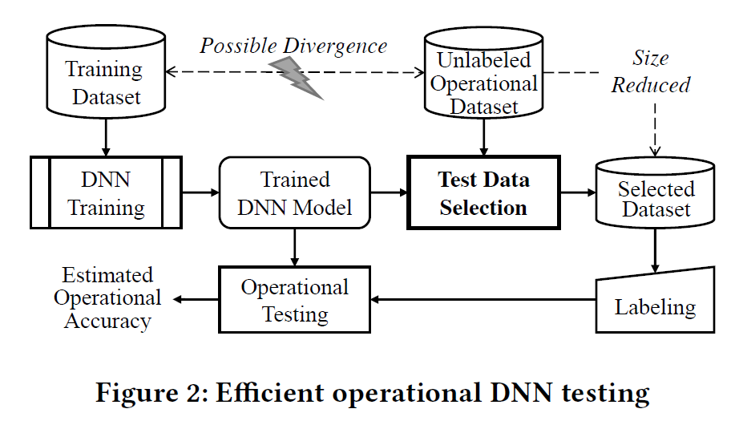
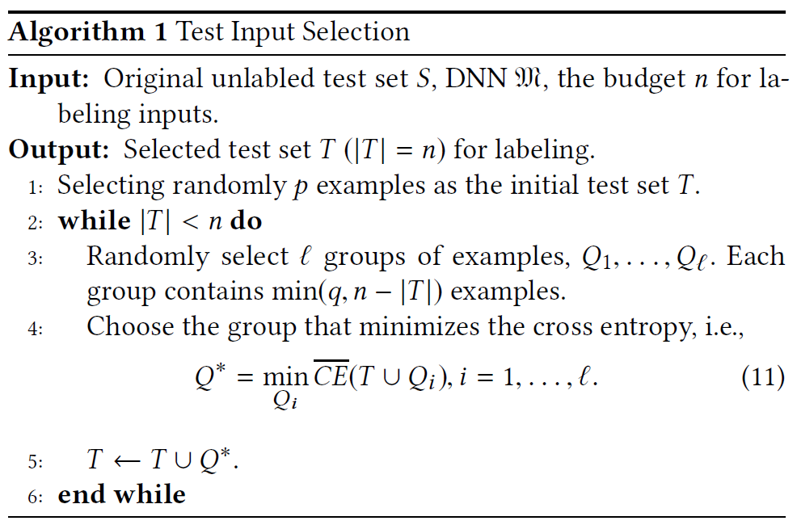

## Boosting Operational DNN Testing Efficiency through Conditioning

#### 背景介绍

随着深度神经网络（DNN）模型在软件系统中越来越广泛的使用，迫切需要对DNN进行有效的操作测试，以确保这些模型在现场条件下的实际性能。然而随之而来的问题是，测试通常需要以非常有限的预算来标记现场收集的数据，并能产生精确的结果。

核心观点是：由DNN学习到的表示和最后一层隐藏层中的神经元信息可以被用来指导对未标记的数据进行采样。

#### 主要贡献

1. 将操作性DNN测试问题的表述表示为使用少量样本进行性能评估，并提出通过条件有效减少方差的测试
2. 提出一种利用待测DNN学习到的高维表示进行操作性DNN测试的方法，并使用基于交叉熵减少的采样算法来实现
3. 一个系统的实证评估，LeNet、VGG和ResNet的实验表明，与简单的随机采样相比，此方法仅需要大约一半的标记输入即可达到相同的精度水平

#### 概念介绍

* DNN测试：一个已完成预训练的DNN模型，在被部署到软件系统中时，它的预测性能往往会大大低于预期值，其原因可能有很多种，比如欠拟合与过拟合，或者训练集和实际数据之间的分布差异，因此一个DNN模型在被投入使用前需要被充分测试。DNN测试和传统软件测试不同，传统软件测试的目的是设计能触发程序错误的测试输入，但是DNN的逻辑是人类无法通俗理解的，所以不能像传统软件那样直观地设计测试输入。因此DNN测试的主要任务就是，在特定的环境下，对DNN模型的预测性能进行评估。如果有足够的测试输入的话，对DNN模型的性能评估应该是很容易的，但是尽管数据很容易收集，但是对数据进行标记却要消耗很大的代价。

    

    目的是通过一些复杂的测试数据选择，只需标记一小部分操作数据即可获得足够的精度以估计操作精度。

#### 方法介绍

##### 问题描述：对于给定的已训练好的模型$M$，一组包括$N$个未标注数据的集合$S$，从$S$中选择不超过指定个数的子集$T\subset S$，并且用$T$尽可能精确地评估模型$M$在未标注集合$S$上的预测性能

##### 基于交叉熵的采样方法(Cross Entropy-based Sampling, CES)

对模型进行性能评估的一个关键问题，就是要找到能够代表模型特征的一个变量$Z$，并且$Z$要便于采样。在CES中，把最后一个隐藏层中的神经元输出作为变量$Z$，也就是用来表示模型在某个样本下的预测结果，从而使预测更容易。选择的理由：

* DNN预测是由最后一个隐藏层的输出的线性组合直接得出的，因此它一定与预测精度高度相关

* 最后一层隐藏层中神经元之间的相关性比之前层中的神经元之间的相关性要小，这便于算法使用它们的近似联合分布

##### 方法步骤：

1. 已训练的DNN模型$M$，模型的最后一层隐藏层$L$包含$m$个神经元，表示为$e_i,i=1,...,m$，$D_{e_i}=\{D_{e_i,1},D_{e_i,2},...,D_{e_i,K}\}$表示神经元$e_i$的输出范围（将神经元的输出范围划分为$K$个等分），$f_{e_i}(x)=j$表示测试输入$x$在神经元$e_i$的输出属于$D_{e_i,j}$，变量$Z$可以表示为向量$(Z_1,Z_2,...,Z_m),Z_i\in\{1,...,k\}$。

    也就是说，最后一个隐藏层有m个神经元，将每个神经元的输出离散化到$K$个范围中的一个，并将所有神经元离散后的值组成向量。

2. 设$S_{z_1,...,z_m}=\{x\in S|f_{e_i}(x)=z_i,1\le i\le m\}$是$S$的一个子集，其中每个元素都被映射到$Z$上，所以$Z$的概率分布$P_S(z)$可以用操作数据集$S$定义为：$P_S(z_1,...,z_m)=\frac{|S_{z_1,...,z_m}|}{|S|}$

    也就是，将上述向量的各类的数目除以总数目获得其离散分布。

3. 由于$Z$的高维性，从测试集$S$中抽取样本非常具有挑战性，因此就需要从一个稀疏分布在高维空间中的有限总体中选择一个小型样本，以使该样本对于总体而言尽可能具有代表性。于是提出了利用最小化$P_S(Z)$与$P_T(Z)$之间的交叉熵来选择样本$T$的方法。即$\underset{T\subset S,|T|=n}{min}CE(T)=H(P_S,P_T)=-\sum_{z\in\{1,...,K\}^m}P_S(z)logP_T(z)$

4. 在高维情况下，由于在$Z$空间中$S$和$T$的稀疏性，很难直接算出交叉熵的最小值。而由于DNN通常会在最后一个隐藏层中降低神经元之间的相关性，因此可以将$Z$空间的每个维度当做近似独立的。所以交叉熵的最小值可以通过最小化$CE(T)$在每个维度上$P_S(Z)$和$P_T(Z)$之间的交叉熵的平均值来计算。也就是$\underset{T\subset S,|T|=n}{min}\overline{CE}(T)=-\frac{\sum_{i=1}^m\sum_{z_i=1}^KP_S^{e_i}(z_i)logP_T^{e_i}(z_i)}{m}$，其中$P_S^{e_i}(z_i)=\frac{|x\in S|f_{e_i}(X)=z_i|}{|S|}$

5. 为了获得最优解，首先随机选择$p$个样本作为初始集合$T$，然后不断使用大小为$q$个样本的集合$Q$扩充集合$T$，直到达到上限$n$个样本，每次集合$Q$的样本都是从$l$个随机选择的组中选择的，从中选择与$T$的交叉熵最小的组。

