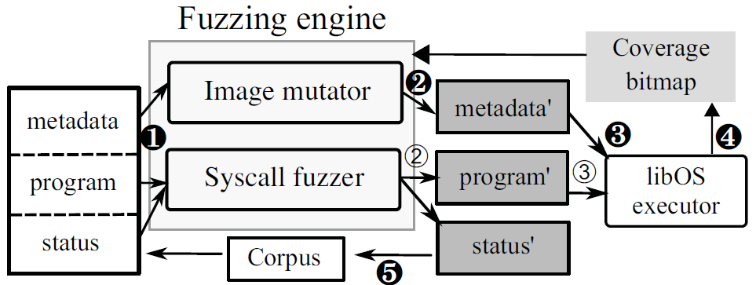
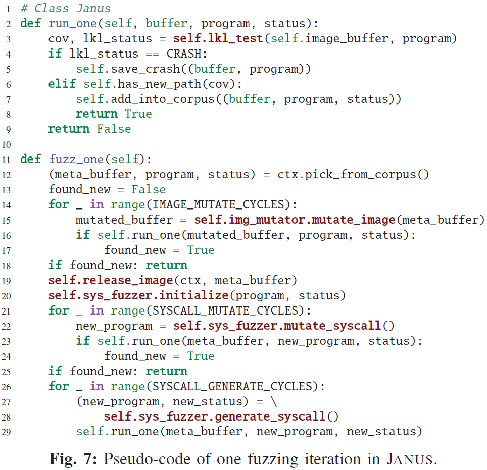

## Fuzzing File Systems via Two-Dimensional Input Space Exploration

##### 提出了第一个反馈驱动的fuzzer——JANUS，用于探索文件系统的两维输入空间，即变异大型镜像的元数据，同时生成镜像导向的文件操作

*JANUS依赖库操作系统而不是传统的 VM 进行模糊测试，这使 JANUS 能够加载操作系统的新副本，从而更容易复现 bug*

*在8个文件系统对 JANUS 进行评估，并在 Linux 内核中发现了90个错误，其中62个已被确认。与 Syzkaller 相比，JANUS 在12小时内有更高的代码覆盖率，在 Btrfs 和 ext4 中分别访问了 4.19 倍和 2.01 倍的代码路径。此外，JANUS能够重现88-100%的崩溃，而 Syzkaller 不能重现。*

#### 背景介绍

对文件系统的模糊测试依赖于两个输入：一个挂载的磁盘镜像和在挂载的镜像上执行的一系列文件操作（即系统调用）。现有的模糊器要么专注于将图像变异为普通的二进制输入，要么生成随机的文件系统调用集，然而存在以下三个挑战：

1. 磁盘镜像是一个结构化但复杂的大型二进制文件，最小尺寸可以比模糊器的最大首选尺寸大100倍，而变异镜像设计到的大量 I/O操作大大降低了模糊测试的吞吐量。现有的模糊器仅对镜像中的非零块进行变异，没有利用磁盘镜像结构化数据的属性，即文件系统布局，其中变异元数据块比变异数据块更有效。在不了解文件系统布局的情况下，现有的模糊器在损坏元数据块后也无法修复任何元数据校验和。
2. 文件操作是上下文感知的工作负载，即磁盘镜像与在其上执行的文件操作之间存在依赖关系。已挂载文件系统的实时状态决定了一组系统调用可以操作哪些文件对象，并且系统调用会改变操作的对象。现有的系统调用模糊器生成带有硬编码路径的随机系统调用，无法生成有意义的文件操作序列，并覆盖文件系统的深层代码路径。
3. 第三个问题是错误的重现，大多数现有模糊器生成测试输入时无需重新加载操作系统实例或文件系统镜像的新副本。这些模糊器依赖 VM、QEMU 或用户模式 Linux (UML) 实例，这些实例需要几秒钟才能重新加载新副本，所以它们不重新初始化操作系统或文件系统，而是重复使用这些实例，导致脏的操作系统状态，以及不稳定的执行和不可重现的错误。

对于三个挑战，JANUS的解决方法：

1. 利用元数据形式的结构化数据属性。只变异种子镜像的元数据块，从而彻底修剪输入的搜索空间。
2. 提出$image$-$directed\ syscall\ fuzzing$来模糊文件操作，即 JANUS 不仅存储生成的系统调用，而且在这些系统调用完成后推导出图像上每个文件对象的运行时状态，然后使用推测的状态作为反馈来生成一组新的系统调用，从而生成$context$-$aware$工作负载。在每次模糊测试迭代期间，JANUS 以更高的优先级对镜像进行模糊测试，然后调用$image$-$directed$ $syscall$ $fuzzing$来全面探索目标文件系统。
3. JANUS 通过在用户空间中运行的库操作系统的帮助下，不断加载操作系统的新副本来测试与文件系统相关的操作系统功能，从而解决了可重复性问题。

#### 概念介绍

##### 文件系统模糊测试，包括两种输入空间：格式化文件系统镜像格式 和 用于获取挂载镜像中的文件的文件操作。现有模糊测试工具的目标是镜像或者文件操作。

1. 磁盘镜像模糊器

    磁盘镜像是大型结构化二进制文件，包括用户数据和多个管理结构（即元数据），文件系统需要这些结构来访问、加载、恢复和搜索数据或满足文件系统的其他特定要求。因此镜像作为模糊测试的输入会导致三个问题：

    * 较大的输入空间会导致探索空间的指数增长，但元数据却很少变异
    * 模糊器对输入文件进行频繁的读写操作，在对磁盘镜像进行模糊测试时，会在变异期间重复读取，变异后写入、保存，从而降低文件操作的速度，导致巨大的性能开销
    * 为了检测元数据损坏，一些文件系统引入了校验和来保护磁盘元数据。因此，内核在初始化期间拒绝损坏的镜像，以及没有正确校验和的变异元数据块

    磁盘镜像模糊器让文件系统在变异磁盘镜像上挂载并运行文件操作序列来触发文件系统bug。早期的模糊器对磁盘镜像进行随机变异以生成新的镜像，或者变异元数据块中的字节，这些方法会因为加载和保存整个镜像而导致大量磁盘I/O操作。现有模糊器由代码覆盖率驱动，提取镜像中的非零块进行变异，涉及大部分元数据块，并通过减少输入大小来提高模糊测试性能。然而，非零块还会丢弃零初始化元数据块，导致次优文件系统模糊测试，由于元数据块没有精确定位，这种方法无法修复它们的校验和。

2. 文件操作模糊器

    直接使用调用系统操作来进行模糊测试，方法很直接，但是有两个原因导致其无法进行高效测试：

    * 只修改镜像中已存在的文件对象，而没有考虑镜像和文件操作之间的动态依赖关系，只是随机生成系统调用序列。*例如：Syzkaller 可能会对文件进行多次`open()`调用，而该文件的旧路径已被重命名`rename()`或删除`unlink()`*
    * 现有操作系统模糊器大多使用虚拟化实例（如KVM、QEMU 等）来运行目标操作系统，而无需为每个测试输入重新加载操作系统或文件系统的新副本，以提高性能。然而对老化的操作系统或文件系统进行模糊测试有两个问题：
        * 在处理大量系统调用后，老化的操作系统的执行变得不确定。*例如，依赖于先前分配的 kmalloc() 在运行中表现不同。有时，内核组件（例如，日志系统）会失败并与操作系统分离，并且不会触发文件系统崩溃*
        * 模糊器发现的错误是由数千次系统调用产生的，导致难以复现错误

3. 文件系统模糊器

    大多数模糊器要么模糊二进制输入，要么使用一系列系统调用来模糊操作系统。模糊文件系统需要变异两个输入：

    1. 二进制镜像（即文件系统镜像）
    2. 相应的工作负载（即一组特定于文件系统的系统调用）

##### 文件系统模糊测试的挑战

1. 将大型磁盘镜像处理为输入

    镜像模糊器应该通过用校验和对镜像中分散的元数据进行变异，并减少由于输入操作而导致的磁盘频繁的 I/O，从而提升大型磁盘镜像模糊测试的效率。但当前的模糊器无法同时解决这些问题。理想的磁盘镜像模糊器应该**只针对元数据**，而不是整个磁盘镜像，并且必须修复变异元数据结构的校验和。

2. 丢失$context$-$aware$工作负载

    文件系统相关的工作负载会直接影响磁盘镜像，有效的文件操作会在运行时修改镜像中的文件对象。然而，现有的模糊器依赖预定义的镜像信息（即种子图像上的有效文件和目录路径）来生成系统调用，从而无法在运行时全面测试目标文件系统中的所有可访问文件对象。 因此更好的方法是在执行过去的文件操作之后，维护图像上每个文件对象的**运行时状态**，以生成新文件。

3. 探索两维输入空间

    文件系统处理两种类型的输入，即二进制blob格式的磁盘镜像和序列化的文件操作，它们之间具有隐式联系。所以充分探索文件系统需要对他们都进行变异，因此提出一种混合方法，通过同时模糊磁盘镜像字节和文件操作来探索两个维度。

4. 复现崩溃

    传统的操作系统模糊器使用虚拟化实例来测试操作系统功能。然而为了避免重启虚拟机或恢复快照的昂贵成本，他们在多次运行中重复使用操作系统或文件系统实例，导致内核执行不稳定和不可重现的错误。这个问题可以通过利用一个库操作系统来解决，该操作系统提供精确的操作系统行为并在几毫秒内重新初始化操作系统状态。

#### 主要贡献

* 确定了现有文件系统模糊器的三个突出问题：
    1. 模糊处理大型 blob 镜像效率低下
    2. 模糊器没有利用文件系统镜像和文件操作之间的依赖关系
    3. 模糊器使用老化的操作系统和文件系统，导致无法重现错误

* 设计并实现了文件系统模糊器 JANUS，可以有效地改变大型种子镜像中的元数据块，同时生成镜像导向的工作负载以广泛探索目标文件系统。JANUS 进一步利用 VM 以外的库OS（即 LKL）来测试 OS 功能，以便在几毫秒内提供全新的 OS 镜像

* 在8个文件系统上评估了 JANUS，并在上游内核中发现了90个错误，其中62个被确认，43 个已被修补。此外，JANUS 在所有选定文件系统上的代码覆盖率方面优于 Syzkaller，在分别对 Btrfs 和 ext4 进行 12 小时模糊测试时，JANUS 最终访问的代码路径比 Syzkaller 多4.19倍和2.01倍，同时 JANUS 可以重现 88-100% 的已发现崩溃，而 Syzkaller 无法重现任何崩溃

#### 方法实现

**JANUS**是一个反馈驱动的模糊器，通过变异种子镜像的元数据生成$context$-$aware$文件操作，以实现对文件系统的全面探索。

##### JANUS的工作流程如下：

JANUS 的二进制输入由三部分组成：

* 包含种子镜像元数据块的二进制 blob
* 描述系统调用序列的程序（即文件系统工作负载）
* 调用文件操作序列后的镜像状态

在模糊测试的每次迭代过程中，JANUS首先从工作语料库中加载一个测试输入，然后模糊测试引擎从两个方向对测试输入进行变异：

1. 对种子镜像进行变异：随机变异镜像的元数据，然后输出变异后的元数据和未变异的测试程序
2. 对系统调用进行变异：对测试程序中的系统调用进行变异，或者插入新指令，然后按照工作负载的变化改变对应的镜像状态，之后输出未变异的元数据和新生成的测试程序

之后JANUS将输出的元数据放入一个完整的镜像中，并将输出的测试程序载入基于库操作系统的运行器中。运行器挂载镜像并运行程序，将其运行路径被配置到与JANUS模糊测试引擎共享的$bitmap$中。如果发现了新的代码路径，则输出的元数据、程序和镜像状态会被打包为新的测试输入并加入工作语料库中。

##### 语料库的构建

**JANUS**依靠其图像解析器和系统调用模糊器在种子图像上构建其初始语料库。语料库中测试用例的<u>第一部分是种子镜像的基本元数据块</u>。**JANUS**首先将整个图像映射到内存缓冲区中，然后文件系统特定的镜像解析器扫描镜像，并根据文件系统的规范定位所有磁盘上的元数据。**JANUS**将这些元数据重新组合成一个缩小的 blob 以进行变异，并记录它们的大小和镜像内偏移。对于任何受校验和保护的元数据结构，**JANUS**记录镜像解析器识别的校验和字段的元数据偏移量。其次，<u>测试用例还包括图像上每个文件和目录的信息</u>，便于之后生成$context$-$aware$工作负载。系统调用模糊器探测种子镜像并检索其上每个文件对象的路径、类型和扩展属性，这些属性被打包到每个初始测试用例中。此外，<u>每个初始测试用例都涉及一个启动程序</u>，该程序具有由系统调用模糊器生成的用于变异的系统调用。为了扩大语料库的整体覆盖范围，每个随机生成的系统调用操作一个特定的文件对象。种子镜像的元数据、文件状态和启动程序构成一个输入测试用例，由**JANUS**打包并保存到磁盘上的语料库中用于模糊测试。

##### 镜像的模糊测试

**JANUS**使用镜像变异器来模糊镜像，首先加载测试样例中的元数据块，然后使用常见的模糊测试方法对元数据的字节进行随机变异。**JANUS**也使用一组特定的整数对元数据进行变异，这些特定的整数能够产生更多极端情况，以增加内核崩溃的可能性。

在对整个元数据 blob 进行变异后，**JANUS**将 blob 中的每个元数据块复制回内其原始完整镜像缓冲区内的相应位置。为了维护镜像的完整性，镜像解析器按照目标文件系统的算法重新计算每个元数据块的校验和值，并在校验和字段的记录偏移量处填充该值。

##### 文件操作的模糊测试

系统调用模糊器使**JANUS**能够生成镜像导向的工作负载，以有效地探索各种文件操作。一个程序包括<u>一个有序的系统调用列表</u>，用于修改变异的镜像，并维护系统调用使用的变量库。**JANUS**将系统调用描述为系统调用号、参数值和返回值的元组，如果参数或返回值是变量，**JANUS**将其表示为保存在变量库中的索引。此外，程序还包括<u>一个由程序打开且未关闭的活动文件描述符列表</u>。

与现有模糊器相似，系统调用模糊器从输入程序生成新的升序也使用两种方式：

1. 系统调用变异：系统调用模糊器从程序中随机选择一个系统调用，并使用新生成的值替换随机选择的参数值
2. 系统调用生成：系统调用模糊器在程序中添加一条参数随机生成的系统调用

生成的参数的候选值与运行时状态无关。对于<u>具有明确定义的可用值集的参数</u>，**JANUS**从集合中随机选择值。对于<u>指针类型的参数</u>，如果是用于存储用户数据的缓冲区（如用于`write()`的`void *buf`），则声明一个数组并用参数的随机值填充；如果是用于内核输出的缓冲区（如用于`read()`的`void *buf`），则使用固定数组，因为**JANUS**不是由内核在运行时输出的内容驱动的，除了代码覆盖率。对于<u>值取决于文件系统运行上下文的参数</u>，**JANUS**生成的值基于其预期类型，并且满足三个规则：

* 如果需要文件描述符，系统调用模糊器会随机选择一个打开的正确类型的文件描述符。例如，`write()`需要一个普通的文件描述符，而`getdents()`需要一个目录文件描述符
* 如果需要路径，系统调用模糊器会随机选择现有文件或目录的路径，或最近操作删除的旧文件或目录。例如，**JANUS**向`rename()`提供普通文件或目录的路径，提供`rmdir()`所需的有效目录的路径。如果该路径用于创建新的文件或目录，**JANUS**随机生成一个位于现有目录下的新路径
* 如果系统调用操作特定文件的现有扩展属性，例如`getxattr()`和`setxattr()`，则系统调用模糊器随机选择记录的文件扩展属性名称

参数生成策略使**JANUS**能够在没有运行时错误，并实现高代码覆盖率的新文件对象上生成$context$-$aware$工作负载。

对于新生成的系统调用，**JANUS**将其添加到程序中，总结系统调用使文件系统产生的变化，并更新镜像的状态。例如，`open()`、`mkdir()`、`link()`或`symlink()`可能会创建一个新文件或目录，而`open()`还引入了一个活动文件描述符，`rmdir()`或`unlink()`从镜像中删除文件或目录，`rename()`更新文件的路径， `setxattr()`或`removexattr()`更新特定的扩展属性。

**JANUS**避免可能潜在造成镜像状态改变的现有参数的变异，以防止变异后产生无效的系统调用。

##### 探索两维输入空间

为了同时模糊元数据和系统调用，**JANUS**按顺序安排了两个核心模糊器。下述代码描述了 JANUS 的一次模糊测试。对于输入测试用例，**JANUS**首先使用镜像变异器以变异缩小镜像上的随机字节，如果在未更改的程序中没有发现新的代码路径，**JANUS**则会调用系统调用模糊器来变异程序中现有系统调用的参数值，如果仍然没有探索到新的代码路径，**JANUS**最终会尝试将新的系统调用添加到程序中。

按这样的顺序调度镜像模糊测试和文件操作模糊测试的效果如下：

* 提取的元数据表示镜像的初始状态，当镜像被多次系统调用操作后，元数据对文件操作执行的影响逐渐减小，因此，**JANUS**总是首先对元数据进行变异
* 引入新的文件操作会成倍地增加程序的变异空间，也可能使得文件操作对镜像的改变消失，因此，**JANUS**更倾向于改变现有的系统调用而不是生成新的系统调用

##### 基于库操作系统的内核运行环境

为了避免老化系统导致的不稳定执行和不可重现的错误，**JANUS**使用基于库操作系统的应用程序来模糊操作系统功能。**JANUS**`fork`一个新的运行器实例来测试模糊测试引擎新生成的镜像和工作负载。与重置 VM 实例相比，`fork`用户应用程序所花费的时间可以忽略不计。因此**JANUS**保证为每个测试用例提供一个低开销的全新内核。此外，由于模糊测试引擎和运行器都在一台机器上的用户空间中运行，因此在它们之间共享输入文件和$bitmap$很简单，这对基于 VM 的模糊器很困难，因为基于 VM 的模糊器在 VM 实例之外运行模糊测试引擎。**JANUS**也比基于 VM 的模糊器使用更少的计算资源。

#### 实验评估

##### RQ1: JANUS发现文件系统未知bug的性能如何？

##### RQ2: JANUS探索文件系统镜像状态，文件操作，包括镜像和文件操作两维输入空间的性能如何？

##### RQ3: 基于库操作系统的运行器复现bug的能力是否要强于传统的VM方法？

##### RQ4: 除了寻找新bug外，JANUS在文件系统上还有什么贡献？

