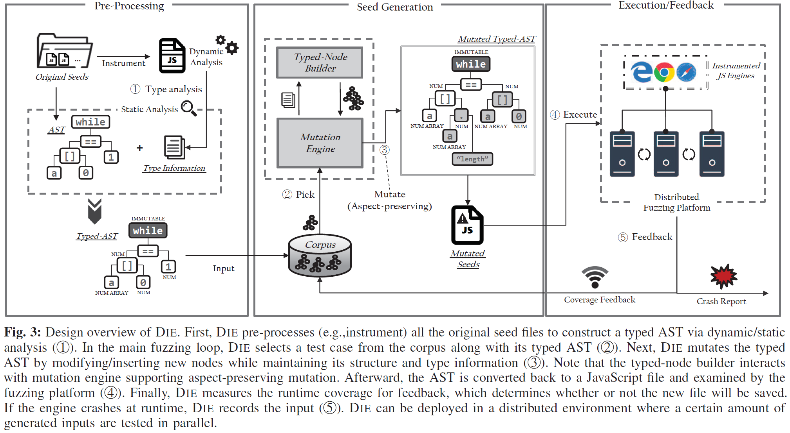
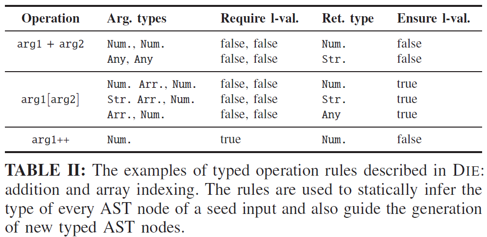
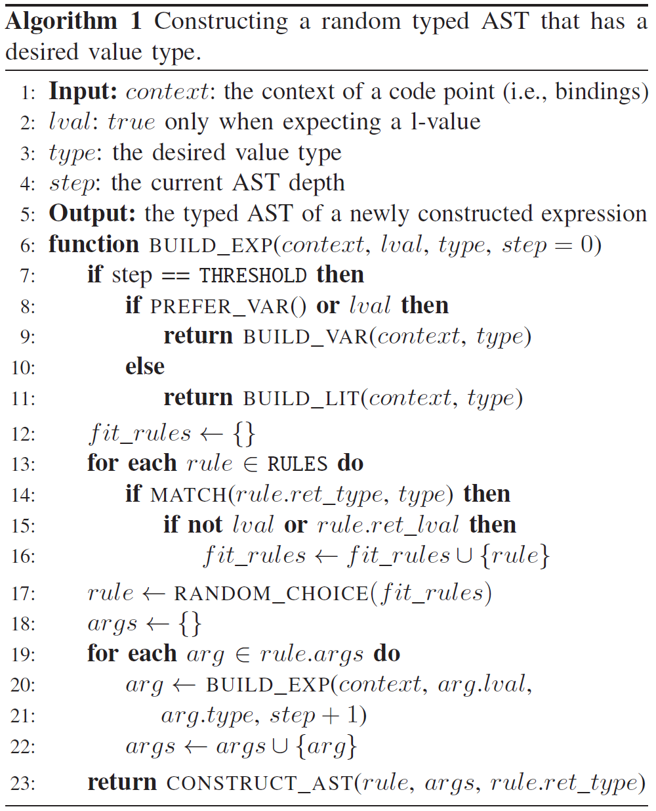
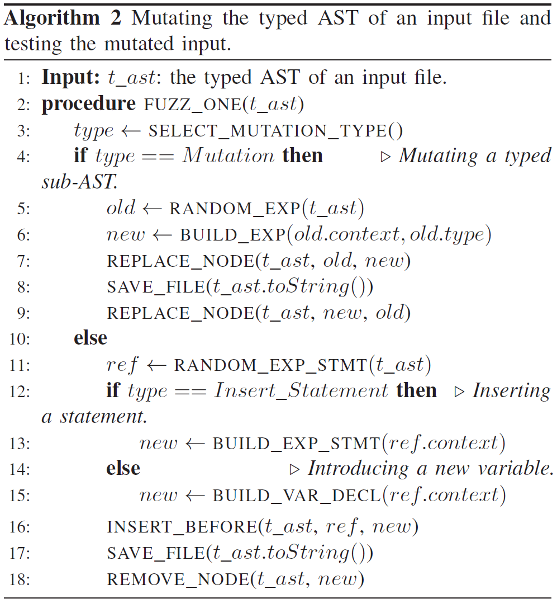

## Fuzzing JavaScript Engines with Aspect-preserving Mutation

##### 提出一种aspect-preserving变异方法DIE，随机保留希望在变异期间维护的属性，包括structure和type两种变异策略。

*aspect：希望在变异过程中保留的语料库的属性*

#### 背景介绍

有关JavaScript的模糊器分为生成方式和变异方式两种。生成方式的模糊器遵循预定义的规则从头开始构建新的测试用例，预定义规则如：JavaScript的上下文无关语法、重新组装从输入语料库中分离出来的可合成代码块。变异方式的模糊器根据现有种子输入来合成测试用例。

现有的模糊测试方法，无论是使用生成方式还是变异方式，都无法完全收集高质量的输入语料库。现有的模糊器倾向于破坏输入语料库中编码的语义或条件以生成新的测试用例，因为这种方法有助于发现程序的新代码路径。然而对于类似JavaScript的复杂程序，这样只能处理代码库的浅层部分。

模糊器希望能完全收集语料库中的有效条件。一种方法是在每个输入语料库中手动对这类条件进行编码，但是由于庞大的输入语料库，以及对模糊器自由探索的限制，约束了模糊器的探索功能。第二种方法是通过程序分析从每个语料库中自动推断出这些先决条件，但是这会影响模糊器的性能。

#### 主要贡献

* 提出了一个$aspect$-$preserving$变异方法，以在变异过程中保留种子输入的属性和先决条件
* 实现了一个JavaScript模糊器$DIE$，通过轻量级的静态和动态分析实现了structure和type两种变异策略
* 报告了48个新bug并解决了其中的38个，其中ChakraCore有28个，JavascriptCore有16个，V8有4个

#### 概念介绍

* ##### JavaScript Engines

    JavaScript引擎是浏览器的重要组成部分，不同引擎的实现方式不同，但是都有两点共性：（1）为JavaScript提供标准化运行环境；（2）提供JIT编译以提高性能

    * **JavaScript**：是一种动态类型语言，变量在运行时可以是任意类型，程序可能会因为运行时的语法或语义错误而中断。JavaScript引擎首先使用解析器创建AST，然后通过解释器将其转化为一级中间表示(IR)，然后使用JavaScript runtime来运行
    * **JIT Compilation**：引擎在运行时通过分析运行状况（类型、调用次数等）来找到潜在的优化点。然后将一级IR（字节码）转换为低级IR序列，罪转换为机器指令以加快执行速度。现代JavaScript引擎在编译过程中使用高级优化技术（例如函数内联和冗余消除），JIT编译器通过插入各种检查来验证优化期间所做的假设，如果优化代码在验证时失败，则回退到未优化的代码。解析器和解释器等面向用户的接口是ECMA262标准的直接实现，但JIT实现对于每个JavaScript引擎是特定的

* ##### Fuzzing JavaScript Engines

    JavaScript引擎的模糊器主要包括生成和变异两种方式。生成类型的模糊器通过预定义的语法从头开始构建新的测试用例，或者通过从大型语料库中分解的可合成代码块来构建测试用例。变异类型的模糊器通过对种子输入的变异来生成新的测试用例。

    现代模糊器利用代码覆盖来加速探索，然而却无法有效繁琐JavaScript引擎的深度错误，原因有二：

    1. 庞大的搜索空间：生成式模糊器从代码单元开始构建新程序，可以控制测试程序中每条语句的生成过程，因此构建无错误输入很简单。但与JIT相关的错误需要有特定属性的输入才能触发，因此搜索空间太大，无法在较短时间内构建此类测试用例。
    2. 对现有程序利用不足：JavaScript模糊器使用单元测试套件和已知错误的PoC作为种子输入，这样的JavaScript程序经过精心设计后能拥有某些特性，模糊器可以根据这些输入快速探索引擎的深层部分，然而现有的模糊器并没有充分利用这一点。

    与上述模糊器不同，$DIE$以混合方式创建新的JavaScript程序，将种子语料与生成的单元合成。$DIE$注重单元测试程序和PoC的特性，使用新的代码段替换与属性无关的代码段，或插入新语句来改变程序，用于变异的新代码段是根据上下文从头生成的。

* ##### Structure-preserving mutation

    维护输入语料库的某些结构(控制流等)，往往会在生成的测试用例时保留$aspect$信息，例如循环结构以及特定的调用顺序对于$JIT$优化很重要。而盲目变异会破坏这些结构，例如JavaScript模糊器$CodeAlchemist$分析所有种子输入并重新生成新的测试用例以进行模糊测试。结构保留是最有效的变异技术，可以在变异过程中保留输入语料库的$JIT$优化阶段等多个$aspect$，可以比未保留结构的变异技术多2倍的bug。

* ##### Type-preserving mutation

    在保留$aspect$时，输入语料库中的$type$能帮助模糊器生成高质量的测试用例。对象类型应该与$JIT$的假定类型匹配，如果不保留种子输入的类型，则生成的测试用例只能探索JavaScript引擎的浅层部分。保留类型可以避免一些语法编译错误和动态运行时错误，以防止程序提前中断。

#### 方法实现

$DIE$是一个变异方式的JavaScript模糊器，利用种子输入的$aspect$来生成有效的测试用例。$DIE$通过高概率保留**影响整体控制流的代码结构**和**所用变量的原始类型**来变异JavaScript输入的 $AST$。代码覆盖率指导和分布式设置还使$DIE$能够大规模解决JavaScript引擎中的深层错误。

##### DIE实现过程：

$DIE$首先预处理原始种子文件以生成$typed$-$AST$，并结合动态和静态类性分析，腿断$AST$中的节点类型。在类型分析之后，$DIE$从语料库中选择种子输入的$typed$-$AST$进行变异。对于给定的$typed$-$AST$，$DIE$通过替换节点(保留$type$)或插入新节点(保留$structure$)来生成新的测试用例。$DIE$通过使用$typed$-$AST$来保留变异过程中的$type$和$structure$，以保留隐含在原始语料库变异时中的$aspect$。之后$DIE$执行生成的测试用例并检查程序是否崩溃或终止。由于程序被插桩，$DIE$还可以在后获取运行时覆盖率，并在访问新代码路径时将其存入输入语料库。

1. ##### 自定义JavaScript类型系统（Custom JavaScript Type System）

$DIE$改进了JavaScript的原始类型系统，改进后的类型系统包括两个特有属性：$Mixed\ type$、$Detailed\ compound\ types$

* **Mixed type**

    $Mixed$类型捕获在运行时变化的类型。由于JavaScript是一种弱类型和动态类型的语言，因此每个变量类型只能在运行时确定，甚至可以在生命周期内修改，引入$Mixed$类型来描述每个语法单元可能具有的所有类型。

* **Detailed compound types**

    $DIE$检查JavaScript对象的子元素类型，以更细粒度的方式定义复合类型，包括三种：

    * $Array$：记录了数组中元素的常用类型，可以是Number或String，具有空槽或各种类型元素的数组被视为$Any$数组
    * $Object$：存储了一个Object实例的形状，由其属性键和值的类型组成
    * $Function$：考虑一个Function实例的参数和返回类型

根据自定义类型，$DIE$可以更好地从给定测试用例中提取语义信息，并且从变异中引入的错误较少。基于自定义类型系统，$DIE$将每个JavaScript操作抽象为一个或多个类型缩减规则。当使用特定类型的参数调用操作时，每个规则声明返回值的类型。下表总结了$DIE$如何重新定义加法和数组索引操作：

2. ##### 类型化AST（Typed ASTs）

$DIE$会改变语料库中保存的JavaScript文件的句法单元，即AST节点，以生成新的测试输入。为了在保持生成输入有效性的同时变异新的AST节点，$DIE$在第一阶段检测每个种子文件的类型和绑定信息。对于从种子文件中检测到的每个节点，$DIE$使用节点在运行时**由$DIE$细化的潜在类型**和**在其范围内可用的一组已声明的变量**对其进行扩展。将这种包含每个AST节点的类型和绑定信息的扩展AST称为为类型化AST。$DIE$为语料库中的每个输入维护类型化AST，并对其进行变异以生成新的JavaScript文件。

由于JavaScript是一种弱类型和动态类型的语言，$DIE$旨在推断AST节点在运行时所有可能的类型。首先，$DIE$在种子文件中动态收集表示标识符的每个AST节点的类型，即对特定变量的引用。在解析出种子的AST后，$DIE$通过在引用标识符节点的语句之前添加一个“蹦床”来检测种子，“蹦床”跳转到一个类型分析函数，该函数检测当前标识符的类型。然后$DIE$运行种子文件并删除重复的类型记录以获取最终的类型集合。通过确定所有叶节点的类型，$DIE$从下到上静态推断其他AST节点的类型。

3. ##### 构建类型化AST节点（Building Typed AST Nodes）

$DIE$依赖其构建器来构建新节点，以对输入的类型化AST进行变异。$DIE$根据变异处的代码点获取节点类型和上下文，然后利用上下文构造一个新的AST，使得其类型与预期类型兼容。

以下算法描述了构建器的实现，返回了新的$typed$-$AST$的根节点。其中$context$表示变异的代码点的上下文，$lval$表示是否需要[$l-value$](https://blog.csdn.net/lijiansheng1986/article/details/79250527)，$type$表示当前节点的类型，$step$表示AST的最大深度

4. ##### 变异类型化AST（Mutating Typed ASTs）

对于特定的输入，$DIE$以$aspect$-$preserving$的方式改变其$typed$-$AST$，以便利用其属性有针对性地测试JavaScript引擎底层组件中的特定代码路径。测试用例的$aspect$很大程度上取决于其$structure$和$type$，因此在变异时，$DIE$避免删除整个`if`语句、循环语句、自定义函数定义和调用等。然后将变异的AST转换成JavaScript代码进行测试。处理完运行结果后，$DIE$将针对下一轮变异对AST所做的更改还原。如果生成的JavaScript文件发现了JavaScript引擎的新代码路径，则其$typed$-$AST$将与代码一起保存。下面的算法展示了$DIE$如何通过$aspect$-$preserving$的变异方式对JavaScript文件进行模糊测试。

$DIE$通过以下方式对JavaScript文件的$typed$-$AST$进行变异：

* 变异类型化AST子树（Mutating a typed sub-AST）

    $DIE$随机选择一个与$structure$无关的AST子树(例如表达式或子表达式)，然后将其替换为一个新的且具有相同类型的子树

* 插入语句（Inserting a statement）

    $DIE$定位一个语句块，并选择一个代码点用于语句插入，然后使用已声明的变量生成一个新的表达式，然后在代码点出插入生层的表达式。表达式是一个值类型+分号的简单形式

* 引入新变量（Introducing a new variable）

    $DIE$使用构建器生成一个随机类型的变量，并随机插入在$typed$-$AST$的任意位置

为了充分利用种子的现有$aspect$，$DIE$在选择变异方式时更喜欢前两种变异方式，只有在长时间未发现新代码路径时，$DIE$才会引入新变量。新生成的输入被保存以供JavaScript引擎进一步执行，然后$DIE$恢复对$typed$-$AST$所做的更改。

5. ##### 分布式环境中的反馈驱动模糊测试（Feedback-driven Fuzzing in Distributed Environment）

由于庞大的输入空间以及运行成本较高而无法在一台机器上处理，$DIE$在分布式环境中使用了覆盖驱动的模糊测试，并开发了自己的代码覆盖同步机制。

