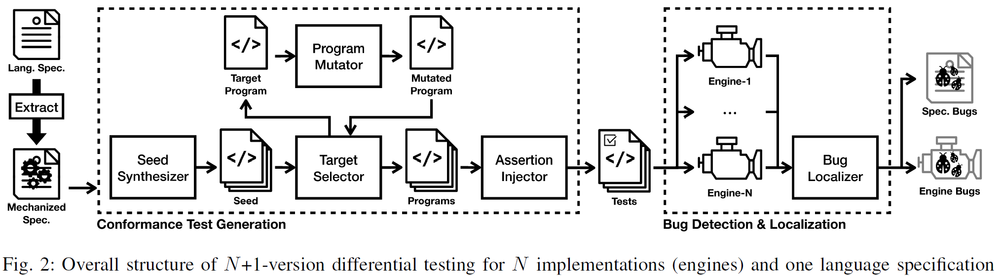
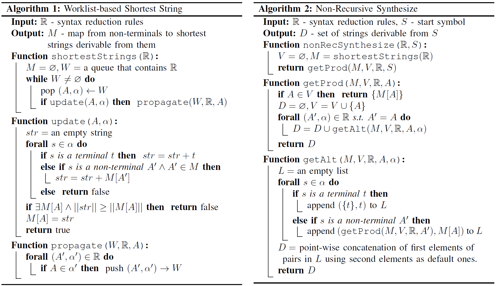

## JEST: N+1-version Differential Testing of Both JavaScript Engines and Specification

##### 提出了一个针对JavaScript引擎和ECMAScript的N+1版差分测试方法JEST，用来解决CI/CD开发过程中语言规范和实现（即解释器或编译器）的正确性问题

###### *ECMAScript是一种用自然语言描述 JavaScript 语法和语义的语言规范；而JavaScript是ECMAScript的一种实现。*

#### 背景介绍

现代软件开发更多的遵循CI/CD开发方式，而不是传统软件开发方式，以快速提供新的语言特性并适应新的开发环境。与传统方法不同，在CI/CD方法中，语言规范不再是语言语义的预言，因为规范及其实现（解释器或编译器）可以共同进化。 在这种情况下，规范和实现都可能有错误，保证它们的正确性并非易事。

CI/CD不是将软件开发分为几个阶段的顺序模型，而是一个快速软件开发、部署和反馈开发的循环。编程语言的开发也使用CI/CD方法。

JavaScript引擎提供了多样化的扩展，以适应快速变化的用户需求，同时，ECMAScript也会不断更新以支持响应用户需求的新功能。 规范和实现中的这种同步更新使它们难以同步。

JavaScript引擎会根据ECMAScript的规范进行更新，同时ECMAScript规范也会根据JavaScript的使用情况进行修订，这样的双向影响使得很难保证他们之间的通信。

在传统的编程语言的方法中，从语言规范到实现的过程是单向的，语言规范被认为是正确的，并使用动态测试来检查实现与规范的一致性。与传统方法不同，在现代CI/CD方法中，规范可能不是预言机，因为规范和实现可以共同进化。

#### 主要贡献

* 提出了N-1版差分测试，是用于解决语言规范及其实现之间问题的新方法
* 实现了JavaScript引擎和ECMAScript的N+1版差分测试工具JEST，用于从ECMAScript中生成JavaScript引擎的一致性测试
* 使用四个常用JavaScript引擎和ECMAScript的最新版对JEST进行评估，找到并定位了四个引擎中的44个bug，以及ES11中的27个bug

#### 概念介绍

***差分测试***

差分测试使用交叉引用预言，假设同一输入上的程序行为之间的任何差异都可能是错误。通过比较具有相同输入的程序在N个不同实现上的执行结果，当一个实现产生与大多数实现不同的结果时，差分测试认为该实现可能存在错误。

***N+1版差分测试***

N+1版差分测试在使用交叉引用预言之外，还使用了一个“机械化”的规范。首先根据规范生成测试代码，并使用生成的测试代码按照差分测试对N个规范上的实现进行测试。当大多数实现的测试都失败时，可以从规范中检测bug。然后使用统计信息定位bug。

***N+1版差分测试总体结构***

**Seed Synthesizer**：使用规范语法生成种子程序，以少量小程序为目标，尽可能多地覆盖语法规则

**Target Selector**：从初始程序池中选择一个能潜在提升程序池语义覆盖的目标程序，通过程序变异后添加到程序池中

**Program Mutator**：变异程序已达到更高的程序池语义覆盖率，如果变异失败则重新选择一个程序

**Assertion Injector**：按照机械化规范执行池中的每个程序，并获得其执行的最终状态，通过对程序池中的程序注入断言生成一致性测试

**Bug Localizer**：在N个引擎上运行一致性测试并获取结果。如果只有小部分的引擎测试失败了，则报告引擎中潜在的bug；如果大部分的引擎测试失败则报告规范中潜在的bug

#### 方法介绍

提出了一个N+1版本的差分测试方法JEST，用来解决CI/CD开发过程中语言规范和实现（即解释器或编译器）的正确性问题，方法包括四个步骤：

1. 根据给定语言规范的语法和语义自动合成程序
2. 通过向合成程序注入断言检查其最终程序状态，来生成一致性测试
3. 通过对多个实现执行一致性测试来检测规范和实现中的错误
4. 使用统计信息定位规范上的错误

* **种子合成器（Seed Synthesizer）**

    包括两种合成器：非递归合成器（Non-Recursive Synthesizer）和内置函数合成器（Built-in Function Synthesizer）

    1. 非递归合成器（Non-Recursive Synthesizer）

        旨在使用两种步骤覆盖尽可能多的语法：

        * 为每个非终结符找到最短字符串
        * 使用最短字符串合成JavaScript程序

        

        ***算法1***：**输入语法约减规则$\mathbb{R}$；输出每个非终结符对应的最短字符串的映射集$M$**

        * $shortestString(\mathbb{R})$：把所有的约减规则$\mathbb{R}$放入队列$W$，每次通过$update$判断一个从$A$到$\alpha$的规则能否使字符串约减，如果可以，则使用$propagete$更新队列
        * $update(A,\alpha)$：输入字符串$A$和它的可替换字符串$\alpha$，依次判断$\alpha$中的每一个字符。如果字符是终结符，表明当前字符不能约减，直接拼接到当前字符串中；如果是非终结符，判断当前字符是否在$M$中，如果在，直接将$M$中$A$对应的可替换字符串拼接到当前字符串，如果不在，则表明当前字符串既不是终结符也不能约减，说明字符串$A$不能约减。最后判断拼接完成后的字符串是否比$M$中保存的字符串更短，并更新
        * $propagate(W,\mathbb{R},A)$：判断约减规则$\mathbb{R}$中的每一种规则$(A'\rightarrow\alpha')$，如果可约减字符串$A$是$\alpha'$的子串，说明字符串$A'$可继续约减，因此将其添加到队列$W$中

        ***算法2***：**输入语法约减规则$\mathbb{R}$和需要约减的字符串$S$；输出由$S$产生的字符串集合$D$**

        * $nonRecSynthesize(\mathbb{R},S)$：初始化访问标记$V$，并通过$shortestString$获取当前约减规则$\mathbb{R}$中每个非终结符对应的最短字符串，保存到映射集$M$中。然后通过$getProd$获取由$S$产出的所有字符串
        * $getProd(M,V,\mathbb{R},A)$：获取由字符串$A$产出的所有字符串。对于字符串$A$，如果$A$已经访问过则返回$A$对应的最短字符串，否则将$A$标记为已访问，并从约减规则$\mathbb{R}$中找出所有$A$的可替换字符串，并通过$getAlt$获取对应的字符串
        * $getAlt(M,V,\mathbb{R},A,\alpha)$：依次判断$\alpha$的每一个字符，如果当前字符是终结符，则将当前字符加入列表$L$；如果是非终结符，则通过$getProd$获取当前字符的可替换字符串集合，并加入列表$L$，最后将$L$中的元素依次拼接，返回拼接后的字符串集合

    2. 内置函数合成器（Built-in Function Synthesizer）

        JavaScript支持很多的内置函数，为了合成包含内置函数调用的JavaScript程序，从机械化的ECMAScript中提取每个内置函数的信息。合成带有可选和可变数量参数的函数调用，以及带有 new 关键字的内置构造函数调用。比如，对于JavaScript中的函数`Array.prototype.indexOf(searchElement[,fromIndex])`，会合成四种函数调用，将一个`array`对象或者是`null`作为对象：
       
       * `Array.prototype.indexOf.call(new Array(), 0)`
       * `Array.prototype.indexOf.call(new Array(), 0, 0)`
       * `Array.prototype.indexOf.call(null, 0)`
       * `Array.prototype.indexOf.call(null, 0, 0)`
       
       其中，`Array`既是一个内置函数也是一个构造函数，所以对于`Array`方法会合成六种程序：`Array()`、`Array(0)`、`Array(0, 0)`、`new Array()`、`new Array(0)`、`new Array(0, 0)`

* **目标选择器（Target Selector）**

    目标选择器的作用是从程序池中选择一个目标程序进行变异，以提高程序池的语义覆盖

    假设在进行`Comparison`算法时，当前程序池为`1 + 2`、`true == false`、`0 == 1`，因为后两种程序的等式两边的类型相同，因此只会覆盖正确的分支，所以程序变异器会将`true == false`变异为`42 == false`，使等式两边类型不同，以覆盖错误分支。此时，程序池变为`1 + 2`、`true == false`、`0 == 1`、`42 == false`

    目标选择器会一直进行，直到语义覆盖收敛

* **程序变异器（Program Mutator）**

    JEST使用五种程序变异方式来提高程序池的语义覆盖

    1. 随机变异（Random Mutation）

        在给定程序中随机选择一个语句、声明或表达式，并用从非递归合成器生成的一组语法树中随机选择的一个来替换它。比如，对于程序`var x = 1 + 2`，其中的表达式`1`可能会被随机替换为`true`，即变异为`var x = true + 2`

    2. 最近语法树变异（Nearest Syntax Tree Mutation）

        针对抽象算法中未覆盖的分支。当一个程序只覆盖一个分支时，它会在程序中找到算法中到达该分支的最近的语法树，并将最近的语法树替换为可从相同语法产生式派生的随机语法树。比如对于程序`var x = "" + (1 == 2)`，只覆盖了`Comparison`算法的错误分支，假设程序池中没有程序能覆盖正确分支，则变异器会找到他最近的正确分支`1 == 2`，将其随机变异为相同语法的其他表达式，如`var x = 41 == 42`

    3. 字符串替换（String Substitutions）

        收集了 ES11 算法条件中使用的所有字符串，并将它们用于随机表达式替换。由于规范中的大多数字符串文字表示极端情况，因此它们对于增加语义覆盖率是必需的

    4. 对象替换（Object Substitutions）

        收集了 ES11 中用作对象属性访问算法参数的字符串文字和符号，使用它们随机生成对象，并用生成的对象替换随机表达式。由于规范中的一些抽象算法使用 `HasProperty`、`GetMethod`、`Get`和`OrdinaryGetOwnProperty`访问对象属性，因此需要变异为具有此类属性的对象才能实现高覆盖率。所以变异器使用“具有相应属性，并且键值是收集的字符串和符号”的对象来对一个随机选择的表达式进行变异

    5. 语句插入（Statement Insertion）

        为了合成更复杂的程序，变异器在随机选择的块（如顶层代码和函数体）的末尾插入随机语句。使用带有预定义特殊语句的非递归合成器生成随机语句，特殊语句是控制转向器，它们可以改变执行路径，如`return`、`break`、`throw`等。变异器选择特殊语句来变异的概率比非递归合成器随机合成的语句更高。

* **断言注入器（Assertion Injector）**

    生成JavaScript程序后，断言注入器使用ECMAScript中指定的最终状态向程序注入断言。首先从机械化规范中获取给定程序的最终状态，并在程序开头注入七种断言。为了在执行所有异步作业后检查最终状态，使用setTimeout为断言设置延时，以在程序使用异步功能时等待100毫秒：`setTimeout(() => { ... /* assertions */ }, 100)`。七种断言方式如下：

    1. 异常（Exceptions）

        JavaScript支持内部异常（如`SyntaxError`、`TypeError`和自定义异常`throw`），使用`try-catch`捕获这类异常时可能会改变程序的语义。例如`var x; function x() {}`不会抛出异常，而`try{ var x; function x() {} } catch (e) {}`则会抛出异常，因为`try-catch`中不允许变量名和函数名相同。

        为了解决这个问题，在程序第一行添加注释，如果程序抛出一个内部异常，则在注释中标记它的名字，例如`// TypeError`；如果是自定义异常则标记`// Throw`；正常终止的程序则标记`// Normal`。JEST根据注释中的标签，检查每个引擎中程序的执行结果。

    2. 中断（Aborts）

        ECMAScript的机械化语义可能会因为未指定的情况而终止。例如`var x = 42; x++;`，后缀`++`使`x`的值加一，但是由于拼写错误，后缀`++`并没有在ES11中定义，从而导致程序中断。为了在一致性测试中表示这种情况，在注释中标记`// Abort`

    3. 变量值（Variable Values）

        注入用于比较变量值与期望值的断言，只检查由测试引入的变量，忽略对预定义变量值的检查。例如`var x = 1 + 2; $assert.sameValue(x, 3);`

    4. 对象值（Object Values）

        为了检查对象值是否相等，为每个对象保留一个代表路径。如果注入器第一次遇到一个对象，它会保留该对象的当前路径作为其代表路径，并为该对象的属性注入断言。否则，注入器添加断言以将对象的值与当前路径和代表路径进行比较。例如：

        `var x = {}, y = {}, z = { p: x, q: y };
        $assert.sameValue(z.p, x);
        $assert.sameValue(z.q, y);`

        注入器在第一次访问变量`x`和`y`时，分别保存两个变量的地址，之后在访问`z.p`和`z.q`的时候，由于其保存的变量`x`和`y`已经被访问过，所以要注入断言，分别比较`z.p`与`x`的值，以及`z.q`与`y`的值

    5. 对象属性（Object Properties）

        检查对象属性涉及检查每个属性的四个属性。设计了一个helper `$verifyProperty`来检查对象的每个属性，比如对于`x.p`的属性检查：

        `var x = { p: 42 };
        $verifyProperty(x, "p", {
        	value: 42.0, writable: true,
        	enumerable: true, configurable: true
        });`

    6. 属性键（Property Keys）

        从ES6开始定义对象中属性键之间的顺序，使用`Reflect.ownKeys`来检查属性键的顺序，其接受一个对象，然后返回一个对象的属性键数组。然后实现一个helper`$assert.compareArray`，用于比较两个数组的长度和内容，例如：

        `var x = {[Symbol.match]: 0, p: 0, 3: 0, q: 0, 1: 0}
        $assert.compareArray(
        	Reflect.ownKeys(x),
        	["1", "3", "p", "q", Symbol.match]
        );`

    7. 内部方法和内部插槽（Internal Methods and Slots）

        虽然用户通常无法访问JavaScript对象的内部方法和插槽，但以下名称可以通过间接 getter 访问：

        |      Name      |             Indirect Getter              |
        | :------------: | :--------------------------------------: |
        | [[Prototype]]  |        `Object.getProtytypeOf(x)`        |
        | [[Extensible]] |         `Object.isExtensible(x)`         |
        |    [[Call]]    |        `typeof f === "function"`         |
        | [[Construct]]  | `Reflect.construct(function(){}, [], x)` |

        内部槽 [[Prototype]] 表示对象的原型，可以通过内置函数`Object.getPrototypeOf`获得。内部插槽 [[Extensible]] 也可通过内置函数`Object.isExtensible`获得。内部方法 [[Call]] 和 [[Construct]] 分别表示给定对象是函数还是构造函数，因为这些方法不是 JavaScript 值，所以直接用 `$assert.callable` 和 `$assert.constructable` 这两个helper来检查它们是否存在。对于 [[Call]]，使用`typeof`运算符，因为当且仅当给定值是具有 [[Call]] 方法的对象时，它才返回“函数”。对于 [[Construct]] 方法，使用`Reflect.construct`内置函数来检查 [[Construct]] 方法的存在并进行调用。

        下面的例子给出了具体的用法：

        `function f() {}
        $assert.sameValue(Object.getPrototypeOf(f), Function.prototype);
        $assert.sameValue(Object.isExtensible(x), true);
        $assert.callable(f);
        $assert.constructable(f);`

* **错误定位器（Bug Localizer）**

    错误检测和定位阶段使用多个JavaScript引擎上给定一致性测试的执行结果。如果少数引擎在运行一致性测试时失败，则引擎可能存在错误；如果大多数引擎测试失败，则测试可能不正确，这意味着规范中存在错误。错误定位器使用错误消息对测试用例进行分类，并对可能存在错误的程序元素进行排名以定位错误。

    使用基于频谱的故障定位(Spectrum Based Fault Localization, SBFL)方法，这是一种基于每个程序元素出现故障的可能性的排名技术，并使用其中理论上最佳的$ER1_b$公式：

    $n_{ef}-\frac{n_{ep}}{n_{ep}+n_{np}+1}$，其中$n_{ef}$，$n_{ep}$，$n_{nf}$和$n_{np}$表明测试用例的数量，下标$_e$和$_n$分别表示测试用例是否接触了相关程序元素，下标$_f$和$_p$分别表示测试用例失败或通过。

    使用ECMAScript的抽象算法作为用于SBFL的程序元素。为了提高定位精度，使用方法级聚合。首先计算算法步骤的SBFL分数，并使用每个算法步骤中的最高分数将它们聚合到算法级别。

#### 实验评估

##### RQ1：生成的测试用例的覆盖率（Coverage of Generated Tests）：由 JEST 生成的测试用例的语义覆盖率 与 Test262 生成的测试用例的语义覆盖率相比如何

*注：Test262是 ECMAScript 的官方一致性测试套件*

##### RQ2：错误定位的准确性（Accuracy of Bug Localization）：JEST是否能准去定位bug的位置

##### RQ3：JavaScript引擎中的错误检测（Bug Detection in JavaScript Engines）：JEST在四个JavaScript引擎中检测到了多少个bug

##### RQ4：ECMAScript中的错误检测（Bug Dectection in ECMAScript）：JEST在ES11中检测到了多少个bug

