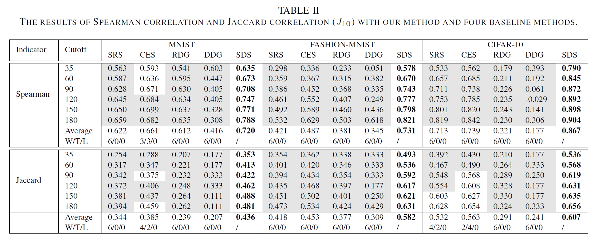

## Measuring Discrimination to Boost Comparative Testing for Multiple Deep Learning Models

##### 核心问题：在有限的标记能力下，如何选出一个高效的测试输入的子集，以实现尽可能对多个DL模型的精确排名

##### 提出了基于样本区分的选择（Sample Discrimination based Selection, SDS），以选择可以区分多个模型的有效样本，这些样本的预测行为将有助于体现模型的性能。

#### 背景介绍

在搭建深度学习模型的时候，对于给定的任务，可以选择很多个可用模型，因此就需要比较不同模型的效果并选择最合适的一个。然而由于样本标记的代价过大，需要选择样本的子集来对模型进行精准的评估。

DL测试分为调试测试(debug testing)和操作测试(operational testing)。

* 调试测试：通过发现模型的缺陷来提升模型可靠性，提出神经元激活覆盖、神经元边界覆盖等指标来生成能出发缺陷的测试输入
* 操作性测试：在客观测试环境中对DL模型进行可靠性评估，比如通过构建用于分布测试的概率模型来评估单个DL模型的准确性

对比测试(comparative testing)：从由不同开发人员构建的DL模型中，对候选模型进行排序，从中选出最合适的模型

对比测试与DL测试的区别：

* 对比测试的测试对象是多个DL模型；而DL测试的对象是单个DL模型
* 对比测试的目的是比较不同DL模型的性能，致力于找到能够区分不同模型的性能的测试输入；而DL测试的目的是提升单个DL模型的性能，致力于找到能致错的测试输入

#### 主要贡献

1. 从对比测试方面进行DL测试，致力于比较多个模型的性能而不是提升单个模型的性能
2. 提出了方法SDS，用于评估样本的区别，并选择具有较大区别的样本来对多个DL模型进行排名
3. 对三个数据集上的80个模型进行实证研究，结果表明SDS与baseline相比有较高性能

#### 方法介绍

##### 问题：对于给定的模型$\mathcal{M_1,M_2,...,M_n}$和未标注样本集$\mathcal{C_t}$，在指定标记代价$\mathcal{E(E\ll|C_t|)}$下，选择$\mathcal{C_t}$的样本子集$\mathcal{C_r(|C_r|=E)}$，并用$\mathcal{C_r}$来评估模型的性能，对模型进行排名，同时保证排名误差尽可能小

SDS包括两个技术思想：

* 多数投票(Majority Voting)：选择投票最多的类别作为最终决策结果。由于样本都是未标记的，因此选择所有模型预测最多的结果作为样本的标签
* 项目区分度(Item Discrimination)：测试项目在多大程度上可以区分被测元素的实际差异。用项目区分度来评估样本的区分度，通过计算每个样本中性能较好的模型与性能较差的模型之间的差异来评估样本的区分度

SDS算法步骤：

1. 记录每个样本$\mathcal{s_j}$在每个模型$\mathcal{M_i}$上的预测结果$\mathcal{A_p[i][j]}$
2. 为每个样本投票得到预估标签。对于每个样本$\mathcal{s_j}$，记录每种标签的预测频率，选择频率最高的标签作为当前样本的标签
3. 划分top models和bottom models。遍历所有样本，对于每个模型，如果模型在当前样本的预测结果与投票结果相同，则将当前模型的得分加一，最后根据模型得分排序，前$27\%$的模型为top models，后$27\%$的模型为bottom models
4. 使用top models和bottom models计算样本区分度。对于样本$\mathcal{s_j}$，其区分度为在当前样本下预测正确的模型中，在top models中的数量减去在bottom models中的数量，区分度越高的样本对于评估模型性能的排名越有效。最后对区分度进行标准化并保存
5. 为了避免具有较高区分度的离群样本的影响，采用随机选择样本的方法，而不是直接从高到低选取样本。首先选择排名最高的$25\%$的样本，然后根据标记代价从中随机选取相应数量的样本

#### 实验评估

##### 数据集(模型数量)：MNIST(28)、Fashion-MNIST(25)、CIFAR-10(27)

##### baseline: CES、DeepGini、SRS

有效性分析：

如果$Wilcoxon\ rank\ sum\ test$的值小于$0.05(p\lt0.05)$并且$Cliff's\ delta$大于$0.147(\delta\gt0.147)$则认为SDS优于对比方法，如果$p\lt0.05$且$\delta\lt-0.147$则认为SDS劣于对比方法。

阴影部分表明SDS优于对比方法，加粗部分是当前条件下的最优方法

