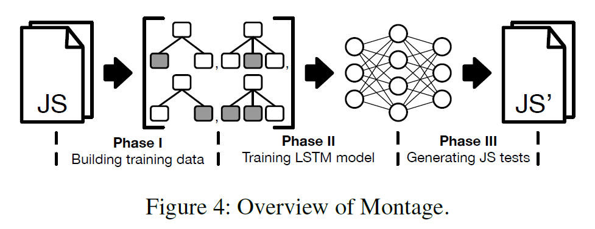

## Montage: A Neural Network Language Model-Guided JavaScript Engine Fuzzer

##### 提出了基于神经网络语言模型(Neural Network Language Model, NNML) Fuzzer，用于检测JS引擎的漏洞。核心思想是将JS的抽象语法树转换为一系列子树，用于直接训练NNML。

#### 背景介绍

现有的 JS 引擎的 Fuzzer 都没有考虑用于生成测试输入的代码片段之间的关系，只是在语法允许的情况下简单地组合代码片段来生成测试输入，因此无法确定哪种代码可能暴露 JS 引擎的漏洞。

作者通过初步研究发现：

1. 新的漏洞通常来自于经过漏洞修补后的 JS 引擎文件
2. 触发新安全漏洞的 JS 测试代码通常由回归测试中已经存在的代码片段组成

#### 概念介绍

1. **语言模型（Language Model）**

    语言模型是单词序列的概率分布，对于自然语言处理任务很重要，例如语音识别、机器翻译和文本生成。语言模型根据单词序列在训练集中的出现历史来估计它的可能性。

    $n$-$gram$语言模型基于前面$n-1$个单词的出现历史来近似这个概率，然而基于计数的语言模型存在数据稀疏问题，导致预测性能较差。

    $NNLM$将单词表示为分布式向量表示，即词嵌入，并将其用作神经网络的输入来解决数据稀疏问题。前馈神经网络$FNN$根据前面的$n-1$个单词预测下一个单词，在这个$NNLM$中，训练集中的所有单词构成一个词汇表$V$，$V$中每个单词都映射到一个特征向量上，然后训练模型以输出$V$中单词的条件概率分布，用于给定上下文中的下一个单词。

    循环神经网络$RNN$能够从任意长度的先前单词的上下文中预测下一个单词，因为$RNN$能够在较长的单词历史中积累信息。$LSTM$模型是一种特殊的$RNN$，它旨在捕获单词之间的长期依赖关系。由于标准$RNN$存在梯度消失/爆炸问题，$LSTM$模型使用$gate$来调节信息传播和内部记忆，以在多个时间步长内更新其训练参数。

2. **JS引擎的模糊测试（JS Engine Fuzzing）**

    模糊测试是动态软件测试的一种形式，其中被测程序与测试输入重复运行以发现程序中的错误。模糊测试可以根据其输入生成方法分为两种类型：变异模糊测试和生成模糊测试。变异模糊测试改变给定的种子以生成新的测试输入，而生成模糊测试基于输入模型（例如语法）生成测试。

    由于 JS 代码是高度结构化的，随机生成的测试输入很可能会被 JS 引擎拒绝。因此，JS 引擎 Fuzzer 通常采用生成方式。

    与之前的方法不同，Montage 受到 CVE（即以前的 JS 引擎漏洞）系统研究的启发，使用经过训练的 $NNLM$ 来学习 JS 回归测试套件之间的句法和语义共性。

#### 方法实现

提出了基于 NNLM 的 JS 引擎的 bug 检测 Fuzzer: **Montage**，基于两个发现：

1. JS 引擎的 bug 往往产生于之前修复了不同错误的补丁代码中
2. 触发新安全漏洞的 JS 测试代码通常由回归测试中已经存在的代码片段组成

从回归测试集的代码碎片中捕获语法和语义关系来训练一个NNLM模型，然后对于一个 JS 回归测试的 AST，使用训练好的 NNLM 模型将AST的一个子树替换为新的子树。从而每个生成的测试都源于一个检查过补丁的回归测试，同时通过在 NNLM 的指导下结合现有片段来执行上下文中的不同功能。

**Montage的整体流程如下：**

其中第一阶段根据给定的回归测试套件准备训练实例，每个训练实例，即片段，都是一个 AST 单元子树序列。第二阶段训练一个 NNLM 模型，学习片段之间的组成关系。第三阶段使用训练后的模型生成 JS 测试。

由于 AST 是由片段组装成的，为防止某些变量或函数在没有声明的情况下使用，Montage使用现有已声明的标识符对其重命名。不同代码中可能有结构和语义相同，但是变量名不同的变量，为了使 AST 具有一致的标识符名称，对 AST 中的所有变量和函数标识符进行重命名。

对于每个声明的变量标识符，按照它们在给定 AST 中出现的顺序分配一个序列号。然后将每个变量名替换为一个新名称，该名称结合了公共前缀及其序列号，例如`v0`和`v1`，对于函数名，则为`f0`和`f1`。

将每个 AST 定义为一个三元组$T=(N,E,n_0)$，其中$N$是$T$中的节点集，$E$是$T$中的边集，$n_0$是$T$的根节点，将节点$n_i$的孩子表示为$C(n_i)$。$T$中的子树$T_i$定义为$T_i=(N_i,E_i,n_i)$，其中$n_i\in N,C(n_i)\ne\emptyset$，$N_i=\{n_i\}\cup C(n_i)$，$E_i=\{(n_i,n')|n'=C(n_i)\}$。

