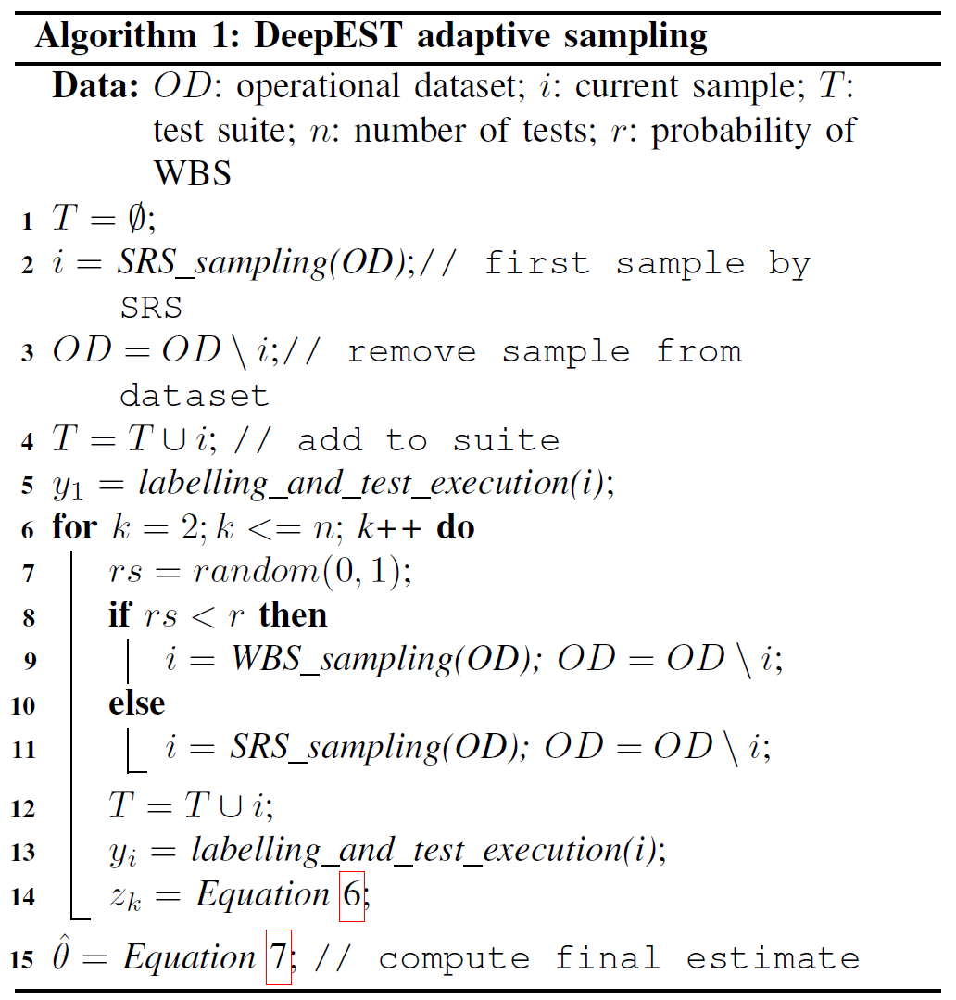

## Operation is the hardest teacher: estimating DNN accuracy looking for mispredictions

##### 提出一种测试输入的选择方法DeepEST，用于在DNN的操作性数据集(operational dataset)中选择一小部分测试输入(有高致错能力)来评估DNN的预测准确性

#### 背景介绍

深度神经网络的测试依赖于测试数据，而由于测试数据的标记代价，需要从中选出一小部分的测试数据来代表整个数据集，并尽可能达到与整个数据集相似的预测效果。在评估模型准确性的时候，同时也需要学习一些致错的测试数据，这些数据往往表明DNN存在的缺陷。

**调试测试**(debug testing)通过提出一些度量指标来指导生成新的测试数据，但是在模型上预测错误的样本数量，以及达到的覆盖率指标只能间接、不能准确体现模型的准确率。

##### 致力于选出能提升模型准确率的测试数据，但是测试数据并不能准确评估模型的预测性能。

**操作测试**(operational testing)目的是从大量未标记数据中选出少量但有效的测试数据来评估DNN在预期环境中的性能

##### 致力于选择能代表模型预测性能的测试数据，但是没有显式寻找能致错的测试数据，因此不能提升DNN的预测性能。

#### 方法介绍

CES和CSS方法都致力于找到能代表模型性能的测试数据，而DeepEST使用能致错的测试数据，然后用他们来评估DNN的准确性。由于样本是通过一定的概率选择的，而致错样本的数量往往比较少，因此采用自适应采样。在自适应采样的过程中，当前选择的样本可能会提示其他致错样本的可能性，从而相应地调整采样过程(基于致错样本在整个样本空间中的分布是不均匀的)。

设计了四种DeepESP的指标，其中一种是基于置信度的指标，两种基于距离，一种结合了置信度与距离：

基于置信度的指标优先选择置信度低的样本(置信度低的样本更可能是致错样本)

基于距离的指标选择距离较大的样本(距离大的样本更可能是致错样本)

* $DeepEST_{CS}$：将置信度作为选择样本的指标
* $DeepEST_{DSA}$：将$DSA(Distance$-$based\ Surprise\ Adequacy)$作为选择样本的距离指标
* $DeepEST_{LSA}$：将$LSA(Likelihood$-$based\ Surprise\ Adequacy)$作为选择样本的距离指标
* $DeepEST_{C}$：使用公式$P=P_c\times(1-P_d)$，其中$P_c$为置信度指标，$P_d$为距离指标，结合两种指标，将$P$作为选择样本的指标

##### DeepEST算法如下：

$OD$：操作数据集

$i$：当前选中的样本

$T$：被选中作为测试的样本

$n$：需要选择的样本数量

$r$：选择$WBS(weight$-$based\ sampling)$作为采样方法的概率

##### 具体步骤如下：

1. 首先初始化并使用$SRS(simple\ random\ sampling)$随机选择第一个被选中的样本，将其加入被选中集合，并从操作数据集中移除

2. 计算第一个被选中样本预测错误的概率，即第一个样本在模型中的输出(1-错误,0-正确)，然后根据置信度或距离指标更新每一个$w_{ij}$的值（$w_{ij}$表示样本$i$和样本$j$之间自适应选择的权重）
3. 根据概率$r$随机选择使用$WBS$或$SRS$方式进行采样选择下一个样本$i$，将样本$i$加入被选中集合，并从操作数据集中移除
4. 重新计算$w_{ij}$的值，计算样本$i$在模型上的输出值$y_i$
5. 根据公式$z_k=\frac{1}{N}(\sum\limits_{j\in s_k}y_j+\frac{y_i}{q_{k,i}})$计算当前选中的样本集预测错误的概率$z_k$，其中$N$是样本总数，$s_k$是已被选中的样本集合，$q_{k,i}$表示样本$i$被第$k$个选中的概率，计算公式为$q_{k,i}=r\cdot\frac{\sum_{j\in s_k}w_{ij}}{\sum_{h\notin s_k,j\in s_k}w_{hj}}+(1-r)\cdot\frac{1}{N-n_{s_k}}$，其中$n_{s_k}$表示当前已选择的样本数量
6. 判断是否已经选择$n$个样本，如果已经满足，计算当前选择的样本的预测准确率$\hat{\theta}$，计算公式为$\hat{\theta}=1-\frac{1}{n}(y_1+\sum\limits_{k=2}^{n}z_k)$，即1减去每一步的$z_k$的平均值；否则跳至步骤3

$w_{ij}$的更新方式（以$DSA$距离为例）：

* 首先计算每个样本的$DSA$值，并将$DSA$值标准化，记样本$i$的$DSA$值为$P_{d_j}$，$DSA$值反映了当前样本的致错能力

* 如果当前选择的样本$i$的$P_{d_i}$超出了设置的阈值$\tau$（如果是以置信度为指标，则选择低于阈值$\tau$），表明样本$i$相对其他样本有很高的致错能力，于是将操作数据集中所有样本$j$与样本$i$的权重设为$w_{ij}=P_{d_j}$，否则设$w_{ij}=0$

    通过这种方式，如果当前选中的样本$i$有很高的致错能力的话，就能激活所有与样本$i$连接的权重

