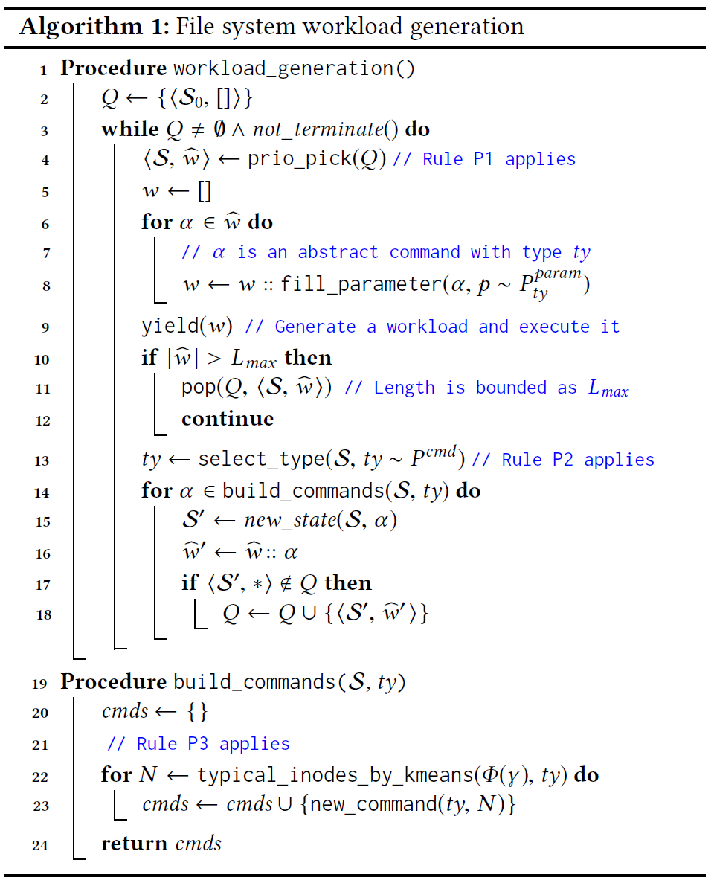

## Testing File System Implementations on Layered Models

##### 通过构建分层模型和抽象工作负载的优化，提出了一种用于解决工作负载生成问题的新方法，此方法实例化为三层文件系统模型，用于生成文件系统工作负载。

#### 背景介绍

为了验证复杂的文件系统，需要生成高质量的测试输入（即工作负载workloads）以驱使系统达到潜在的错误状态。生成高质量的文件系统调用序列(file system call sequences)对测试文件系统很重要，但是也由于输入空间过大而极具挑战性。

现有的模糊测试方法类似系统调用的随机生成器，因为基于覆盖信息不能达到文件系统的不同状态。而由于复杂系统的复杂性，为其构建一个精准而完善的模型是不现实的。因此，模型检查(model checking)，基于模型的测试(model-based testing)或格式验证(format verification)仅限于核心功能的一小部分。

#### 概念介绍

* ##### **分层建模**（Layered Modeling）

    为了对用于测试输入（即工作负载）生成的复杂系统进行建模，核心观点是复杂系统总是从更简单的系统演化而来，而演化过程可以作为设计模型的指导。因此，分层建模的思想认为工作负载生成应该从构建简单、抽象并反映早期版本中设计的基本功能的最高级核心模型开始，而不是直接使用语法引导的模糊测试或基于模型的测试。初始模型是一个有序集合$M_0=\{w_1^{(0)},w_2^{(0)},...\}$，其中的$w_1^{(0)},w_2^{(0)}$应该按顺序生成，其中每一个低层模型都是高层模型的细化。对于第$i$层的工作负载$w\in M_i(0\le i\le n)$，第$i+1$层的模型$M_{i+1}(w)$也是一个工作负载的有序集合：$M_{i+1}(w^{(i)}=\{w_1^{(i+1)},w_2^{(i+1)},...\})$，直到最后一层语法模型$M_n$生成可运行的具体工作负载。

    为了保证工作负载的有效性，需要设计一个具有简单和精确规范的语义感知核心模型。因此高层抽象工作负载需要以更可控的方式生成，在核心模型中生成的工作负载在核心系统行为方面尽可能多样化。低层模型应该按照建模语义难度升序引入复杂系统行为，因此会丢失工作负载语义，而如果将模型细化$M_{i+1}(w^{(i)})$设计为尽可能保留语义，即使模型细化并不完全合理，低层工作负载也能与抽象工作负载有相似的行为。

    这种建模方法适用于很多复杂的系统，包括：

    * 编程语言从用于描述基于控制结构计算的简单核心构造演变而来。为了生成用于测试编译器的程序，可以将简单的构造作为核心模型，模型中的数据流和控制流是确定的。现代编译器扩展（语法糖、函数/变量属性、内联汇编等）可以在较低级别的模型中松散地建模，以执行不同的编译器行为
    * 多线程程序也是顺序程序，因此对多线程程序的测试，可以在粗粒度并发（函数级/组件级）上构建核心模型，并为不同的程序状态生成工作负载。然后在较低级别的模型上进行细粒度的交织行为（竞争或死锁定向测试）
    * 分布式系统的协议是在实际实现之前设计的，这些协议在实践中被广泛地进行模型检查，可以作为核心模型。通过扩展具有代码级复杂性的抽象工作负载可以进一步验证分布式系统实现，例如，注入API故障或执行线程级并发。

* ##### 在分层模型上生成高效工作负载（Generating Effective Workloads on Layered Models）

    “大多数缺陷可以被简化系统模型加上一些特殊论据来解释”，这一观点可以被认为是“**小范围假设**”在复杂系统上的变体，即通过在某个小范围内测试程序的所有测试输入，可以发现高比例的错误。

    因此需要通过枚举、模型检查或测试来系统地执行抽象工作负载，以最大化行为覆盖范围（即获得多样的抽象工作负载）。较低级别的模型可能会丢失语义，所以应该在受控的随机扰动下生成保留语义的工作负载。

    抽象工作负载$w\in M_0$可以表示为具体工作负载的组合$\mathcal{W}(w)=M_n(...M_2(M_1(w)))$，因此在设计模型时要**尽可能保证$w^{(n)}\in\mathcal{W}(w)$的行为与$w$相同**。如果工作负载$w$和$w'$行为不同，则认为$\mathcal{W}(w)$和$\mathcal{W}(w')$中的所有工作负载的行为都不同，即$\mathcal{W}(w)\cap\mathcal{W}(w)=\empty$。因此**最大化$M_0$中抽象工作负载的多样性**可能会导致最终具体工作负载的语义多样化。最终实现**语义可控性**（通过在高级模型中进行语义建模）和**语法多样性**（通过向低级模型添加随机性）的平衡。

#### 主要贡献

* 提出了用于生成工作负载的复杂系统建模方法，考虑了生成工作负载时，语义可控性和随机性之间的平衡
* 提出一个针对文件系统实现，用于生成高效文件系统调用序列的模型和检测器
* 设计了一个原型工具**Dogfood**，并对其评估，检测到了12个未知bug

#### 方法介绍

提出了一种基于模型的方法来解决工作负载生成问题，并实现了原型工具**Dogfood**，关键思想是将系统分解为与系统演化历史一致的分层模型。模型首先构建既捕获了系统的简化语义，也体现了系统基本功能的高级核心模型，然后逐步细化模型中的工作负载以获得较低级别的工作负载，最后实现一个句法完整的模型（理论上涵盖了所有可能的工作负载），其中无法指定工作负载行为。

在细化过程中，一个高级工作负载$w$（抽象）可能对应多个细化的低级工作负载$W'$（抽象/具体）。因此设计的分层模型应尽可能使得$W'$的行为与$w$基本相似，对于一个用于生成高质量的多样化抽象工作负载的高级模型，在细化过程中，既要保留高级工作负载的多样性，也要将随机性添加到工作负载中，以训练模型中不切实际的系统行为。

三层文件系统模型：

* **核心模型**（core model）：捕获所有现有UNIX文件系统变体的通用和可预测语义，提供了文件系统有向无环图结构的最小抽象，以及一组用于操作图结构的抽象文件系统调用。

    核心模型$M_0$捕获了UNIX文件系统中文件和目录结构的有向无环图，其**核心是一个抽象文件系统模型**，对路径、inode、链接和文件描述符进行建模，而不是对文件内容进行建模。核心模型中包含10个抽象文件系统调用，用于创建/删除/操作抽象文件和目录，它们的形式语义是明确定义的。

    *给定核心模型中的两个抽象工作负载，可以精确地确定它们在文件/目录结构方面的差异。 此属性对于系统地枚举各种抽象工作负载至关重要。*

* **核心扩展模型**（core-ext model）：通过添加扩展抽象文件系统调用来细化核心模型中的工作负载。 这种扩展调用体现了在系统演化过程中开发的复杂功能，难以精确指定。扩展文件系统调用的示例包括：读写打开的文件、访问扩展属性、对文件系统执行结构更改。

    为了在一定程度上对这些行为进行建模，核心扩展模型$M_1$**继承了核心模型中的抽象文件系统**，并增加了11个文件系统调用，以**体现不同的文件系统行为**，例如磁盘文件系统状态和日志记录。

    对于给定的核心模型$M_0$中的抽象工作负载$w$，核心扩展模型通过将$w$随机与核心扩展抽象文件系统调用交织，以细化$w$。$M_1(w)$中的工作负载虽然有许多随机行为，但如果仅关注$w$中的文件和目录，则其行为与具体文件系统中的行为大致相似。

* **语法模型**（syntax model）：通过对所有其他系统调用参数（权限、标志、长度等）进行语法建模来进一步细化核心扩展模型中的工作负载。语法模型可以生成所有可能的文件系统调用序列。将核心模型和核心扩展模型中的21个抽象系统调用转换为系统调用序列，并用随机值填充所需的参数。

分层模型不是使用语法模型直接生成工作负载，而是将工作负载生成的每个阶段中的关注点分开。核心模型和核心扩展模型经过系统的模型检查，产生高质量的“抽象”系统调用序列，然后填充语法模型中定义的随机参数，最终获得可运行的工作负载。

抽象文件系统可以表示为$\mathcal{S}=<\mathcal{N},E,\mathcal{F},\gamma>$，其中$<\mathcal{N},E>$组成了一个无环图；$\mathcal{N}$是所有inode的集合；$E$表示所有$<\mathcal{N}\times string>\mapsto\mathcal{N}$的边的集合，即从目录+文件名到文件inode；$\mathcal{F}$是所有打开的文件的集合；$\gamma\in\mathcal{N}$是当前的工作目录。初始状态为$\mathcal{S}_0=<\{N_{root},\empty,\empty,N_{root}\}>$，其中将指定路径转为inode的方法如下：

$\gamma(p)=\left\{\begin{array}{c}
N_{root}, & p=/\\ 
\gamma(\gamma(p^{\Lsh})\upharpoonright_{symlink}::s_{n-1}), & \gamma(p^{\Lsh})\upharpoonright_{type}=symlink \\ 
E[<\gamma(p^{\Lsh}),s_{n-1}>], & E[<\gamma(p^{\Lsh}),s_{n-1}>]\upharpoonright_{type}\ne symlink \\
\gamma(E[<\gamma(p^{\Lsh}),s_{n-1}>]\upharpoonright_{symlink}), & E[<\gamma(p^{\Lsh}),s_{n-1}>]\upharpoonright_{type} = symlink \\ 
\bot, & otherwise
\end{array}\right.$

对于一个inode $N$，其属性向量表示为：$[type,{\small\#}symlinked,atime,{\small\#}depth,{\small\#}hardlink,{\small\#}children,{\small\#}open]$

其中$type$表示$N$的文件类型；${\small\#}symlinked$表示$N$的符号链接的数量；$atime$表示$N$最后一次被获取的时间；${\small\#}depth$表示$N$的文件深度；${\small\#}hardlink$表示$N$的硬链接数；${\small\#}children$表示目录$N$下的子文件或子目录数；${\small\#}open$表示指向$N$的打开文件的数量

使用有界模型检查（Bounded Model Checking）可以获取所有不等价的文件系统状态$\mathcal{S}$，但是有界模型检查对于长工作负载的扩展性很差，而长工作负载对于深层文件系统状态很重要。因此在有界模型检查的基础上添加了优先级，使得既能快速生成大量工作负载，又能覆盖所有不等价的抽象文件系统状态。优先级规则包括三个方面：

* $P1$：优先选择长工作负载，因为其更可能产生更多IO操作、磁盘碎片等，以执行不同的文件系统状态
* $P2$：附加指令时，指令类型是由概率分布$P_{cmd}$得出的
* $P3$：选择inode作为新指令的参数时，优先选择可能探索系统未探索状态的inode

算法从初始抽象文件系统状态$\mathcal{S}_0$和空工作负载开始。对于每次迭代，首先根据$P1$从队列$Q$中选择一个工作负载$\hat{w}$，然后根据指令类型$ty$，从概率分布$P_{ty}^{param}$中生成合适的参数，再对$\hat{w}$进行细化。如果$\hat{w}$的长度达到上限，则将其移除，否则继续在其后面添加新指令。根据$P3$选择新指令的inode参数时，根据inode之间的相似性来排名，与其他inode更不相似的inode的排名更高，通过k-means聚类实现

